# Sentinel-Go Deep Dive

A comprehensive technical guide to all packages in Sentinel-Go.

---

## Table of Contents

### SQL Package

1. [SQL Overview](#sql-overview)
2. [SQL Driver Wrapping](#sql-driver-wrapping)
3. [SQL Query Instrumentation](#sql-query-instrumentation)
4. [SQL Query Sanitization](#sql-query-sanitization)

### SQLX Package

5. [SQLX Overview](#sqlx-overview)
6. [SQLX Struct Scanning](#sqlx-struct-scanning)
7. [SQLX Named Parameters](#sqlx-named-parameters)
8. [SQLX Transactions](#sqlx-transactions)

### HTTPClient Package

9. [HTTPClient Overview](#httpclient-overview)
10. [Transport Chain](#transport-chain)
11. [Retry with Backoff](#retry-with-backoff)
12. [Circuit Breaker](#circuit-breaker)
13. [Hedged Requests](#hedged-requests)
14. [Adaptive Hedging](#adaptive-hedging)
15. [Chaos Injection](#chaos-injection)
16. [Request Coalescing](#request-coalescing)
17. [Rate Limiting](#rate-limiting)
18. [Request/Response Interceptors](#requestresponse-interceptors)
19. [Mock Transport](#mock-transport)
20. [Observability](#observability)

---

# SQL Package

## SQL Overview

The `sql` package provides an instrumented wrapper around Go's standard `database/sql` package with automatic OpenTelemetry tracing and metrics.

### The Problem: Invisible Database Performance

Database queries are often the **slowest and most critical** part of any application. Yet, standard `database/sql` provides zero visibility:

```go
// Standard sql - completely opaque
rows, err := db.QueryContext(ctx, "SELECT * FROM users WHERE status = $1", "active")
// How long did this take? What query was run? No idea!
```

**Without instrumentation, you cannot answer:**

- Which queries are slow?
- How many queries per request?
- Is there an N+1 query problem?
- What's the connection pool utilization?
- Which query caused the timeout?

### The Solution: Transparent Instrumentation

Sentinel SQL wraps `database/sql` at the driver level, making instrumentation **automatic and invisible** to your application code:

```go
import sentinelsql "github.com/kroma-labs/sentinel-go/sql"

// One-line change: sql.Open → sentinelsql.Open
db, err := sentinelsql.Open("postgres", dsn,
    sentinelsql.WithDBSystem("postgresql"),
    sentinelsql.WithDBName("myapp"),
)

// Your code stays exactly the same
rows, err := db.QueryContext(ctx, "SELECT * FROM users WHERE status = $1", "active")
// Now: span created, latency recorded, query logged!
```

### Features

| Feature                 | What It Does                | Why It Matters                    |
| ----------------------- | --------------------------- | --------------------------------- |
| **Tracing**             | Span per query              | See queries in distributed traces |
| **Metrics**             | Latency histograms          | Detect slow queries, regressions  |
| **Operation Detection** | SELECT/INSERT/UPDATE/DELETE | Group metrics by operation type   |
| **Query Sanitization**  | Mask sensitive values       | Safe logging without PII exposure |
| **Connection Tracking** | Pool metrics                | Detect exhaustion, leaks          |

---

## SQL Driver Wrapping

### The Challenge: Instrumentation at Scale

You could manually instrument every query:

```go
// Manual instrumentation - tedious and error-prone
span := tracer.Start(ctx, "db.query")
start := time.Now()
rows, err := db.QueryContext(ctx, query, args...)
span.SetAttributes(attribute.String("db.statement", query))
span.RecordError(err)
span.End()
metrics.RecordLatency(time.Since(start))
```

Problems:

- Repetitive boilerplate at every call site
- Easy to forget or do inconsistently
- Doesn't capture prepared statements
- Misses implicit queries (from ORMs, migrations)

### The Solution: Driver-Level Wrapping

Sentinel SQL wraps the driver itself, so **every query is automatically instrumented**:

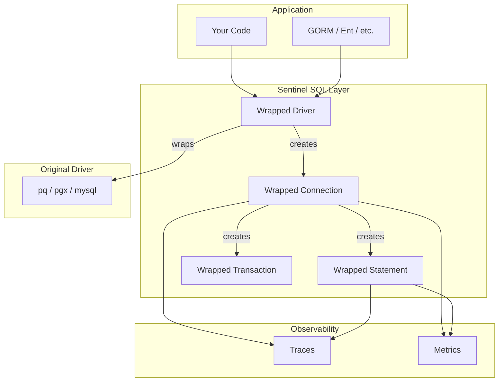

### How Wrapping Works

Every interface in `database/sql/driver` is wrapped:

| Original Interface | Wrapped Version | What We Capture              |
| ------------------ | --------------- | ---------------------------- |
| `driver.Driver`    | `wrappedDriver` | Connection open              |
| `driver.Conn`      | `wrappedConn`   | Query, Exec                  |
| `driver.Stmt`      | `wrappedStmt`   | Prepared statement execution |
| `driver.Tx`        | `wrappedTx`     | Commit, Rollback             |

### Two Integration Methods

```go
// Method 1: Direct Open (recommended for new code)
db, err := sentinelsql.Open("postgres", dsn, opts...)

// Method 2: Register wrapped driver (for existing codebases)
driver := sentinelsql.WrapDriver(pq.Driver{}, opts...)
sql.Register("postgres-instrumented", driver)
db, err := sql.Open("postgres-instrumented", dsn)  // Use new name
```

### Why Driver Level?

| Approach               | Coverage  | Effort       | Consistency  |
| ---------------------- | --------- | ------------ | ------------ |
| Manual instrumentation | Partial   | High         | Inconsistent |
| Middleware             | HTTP only | Medium       | Good         |
| **Driver wrapping**    | **100%**  | **One-time** | **Perfect**  |

---

## SQL Query Instrumentation

### Span Lifecycle

Every database operation creates a span with precise timing:

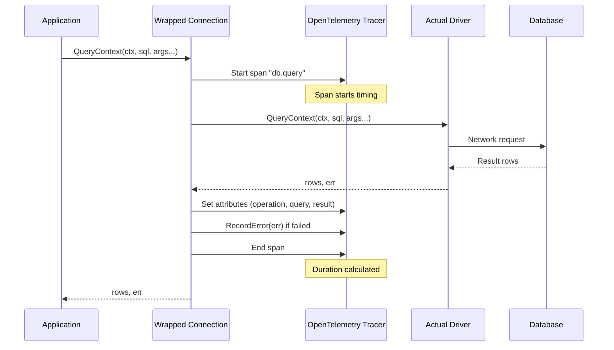

### Span Attributes

Each span carries rich context:

| Attribute              | Example                             | Source                  |
| ---------------------- | ----------------------------------- | ----------------------- |
| `db.system`            | `postgresql`                        | Configuration           |
| `db.name`              | `users_db`                          | Configuration           |
| `db.operation`         | `SELECT`                            | Extracted from query    |
| `db.statement`         | `SELECT * FROM users WHERE id = $1` | Query (if not disabled) |
| `db.instance`          | `primary`                           | Configuration           |
| `db.connection_string` | `(sanitized)`                       | DSN                     |
| `net.peer.name`        | `db.example.com`                    | Extracted from DSN      |
| `net.peer.port`        | `5432`                              | Extracted from DSN      |

### Operation Detection

The wrapper parses the first word of the query to classify it:

```go
func detectOperation(query string) string {
    // Normalize and extract first keyword
    query = strings.TrimSpace(strings.ToUpper(query))

    switch {
    case strings.HasPrefix(query, "SELECT"):
        return "SELECT"
    case strings.HasPrefix(query, "INSERT"):
        return "INSERT"
    case strings.HasPrefix(query, "UPDATE"):
        return "UPDATE"
    case strings.HasPrefix(query, "DELETE"):
        return "DELETE"
    case strings.HasPrefix(query, "BEGIN"):
        return "BEGIN"
    case strings.HasPrefix(query, "COMMIT"):
        return "COMMIT"
    case strings.HasPrefix(query, "ROLLBACK"):
        return "ROLLBACK"
    default:
        return "OTHER"
    }
}
```

This enables metrics like "SELECT queries P95 latency" vs "INSERT queries P95 latency".

### Metrics Emitted

| Metric                       | Type      | Labels                     | Purpose                    |
| ---------------------------- | --------- | -------------------------- | -------------------------- |
| `db.client.query.duration`   | Histogram | operation, db.name, status | Query latency distribution |
| `db.client.connections.open` | Gauge     | db.name                    | Current open connections   |
| `db.client.connections.max`  | Gauge     | db.name                    | Max pool size              |

---

## SQL Query Sanitization

### The Security Problem

SQL queries often contain sensitive data:

```sql
-- Passwords in queries
SELECT * FROM users WHERE email = 'john@example.com' AND password_hash = 'abc123secret'

-- Personal data
INSERT INTO payments (user_id, card_number) VALUES (1, '4242424242424242')

-- API keys
SELECT * FROM integrations WHERE api_key = '******'
```

If you log these queries (for debugging, observability), you're exposing:

- Passwords and credentials
- Credit card numbers
- Personal information
- API keys and secrets

### The Solution: Query Sanitization

Sanitization replaces literal values with placeholders before logging:

```go
db, _ := sentinelsql.Open("postgres", dsn,
    sentinelsql.WithQuerySanitizer(sentinelsql.DefaultQuerySanitizer),
)

// What your code executes:
// SELECT * FROM users WHERE email = 'john@example.com' AND password_hash = 'abc123'

// What gets logged/traced:
// SELECT * FROM users WHERE email = ? AND password_hash = ?
```

### How DefaultQuerySanitizer Works

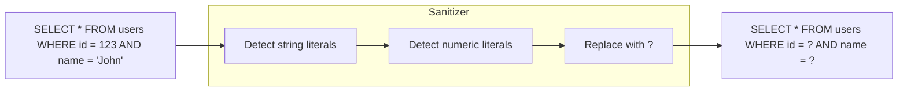

The default sanitizer handles:

- Single-quoted strings: `'value'` → `?`
- Double-quoted identifiers: preserved (they're column names)
- Numbers: `123` → `?`
- Hex values: `0xFF` → `?`

### Custom Sanitizers

For special cases, implement your own:

```go
// Custom sanitizer that preserves table names
mySanitizer := func(query string) string {
    // Your custom logic
    // Maybe use regex, parsing, or SQL-aware tokenization
    return sanitizedQuery
}

db, _ := sentinelsql.Open("postgres", dsn,
    sentinelsql.WithQuerySanitizer(mySanitizer),
)
```

### Disable Query Logging

For maximum security, disable query logging entirely:

```go
db, _ := sentinelsql.Open("postgres", dsn,
    sentinelsql.WithDisableQuery(true),  // Query not included in spans
)
```

---

# SQLX Package

## SQLX Overview

The `sqlx` package wraps [jmoiron/sqlx](https://github.com/jmoiron/sqlx) with OpenTelemetry instrumentation. SQLX extends `database/sql` with powerful conveniences while maintaining full compatibility.

### The Problem: Verbose Row Scanning

Standard `database/sql` requires tedious manual scanning:

```go
// Standard sql - verbose and error-prone
rows, err := db.Query("SELECT id, name, email, created_at FROM users WHERE active = true")
if err != nil {
    return nil, err
}
defer rows.Close()

var users []User
for rows.Next() {
    var u User
    // Must match column order exactly!
    if err := rows.Scan(&u.ID, &u.Name, &u.Email, &u.CreatedAt); err != nil {
        return nil, err
    }
    users = append(users, u)
}
if err := rows.Err(); err != nil {
    return nil, err
}
return users, nil
```

Problems:

- **Verbose**: 15 lines for a simple query
- **Error-prone**: Column order must match exactly
- **Maintenance burden**: Add a column? Update every Scan() call
- **No reuse**: Same boilerplate repeated everywhere

### The Solution: SQLX Struct Scanning

SQLX automatically maps columns to struct fields:

```go
import sentinelsqlx "github.com/kroma-labs/sentinel-go/sqlx"

type User struct {
    ID        int       `db:"id"`
    Name      string    `db:"name"`
    Email     string    `db:"email"`
    CreatedAt time.Time `db:"created_at"`
}

// One line, type-safe, maintainable
var users []User
err := db.SelectContext(ctx, &users, "SELECT * FROM users WHERE active = true")
```

### Features

| Feature           | Standard sql  | SQLX           |
| ----------------- | ------------- | -------------- |
| Row → Struct      | Manual Scan() | Automatic      |
| Named params      | Not supported | `:name` syntax |
| Get single row    | Query + loop  | `Get()`        |
| Get multiple rows | Query + loop  | `Select()`     |
| Column mismatch   | Runtime panic | Clear error    |

---

## SQLX Struct Scanning

### How Mapping Works

SQLX uses reflection to match database columns to struct fields:

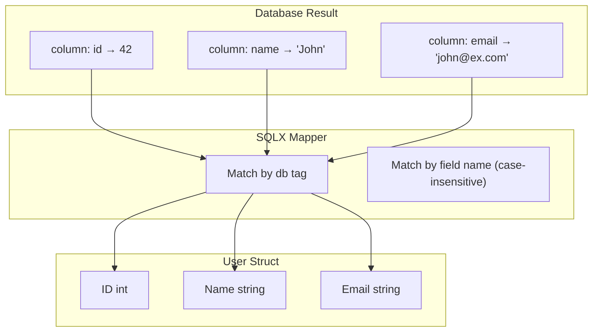

### Mapping Priority

1. **`db` tag** (highest priority): `db:"column_name"`
2. **Field name** (case-insensitive): `UserName` matches `username`

```go
type User struct {
    ID        int    `db:"user_id"`      // Maps to "user_id" column
    FirstName string `db:"first_name"`   // Maps to "first_name" column
    Email     string                     // Maps to "email" or "Email" column
}
```

### Get vs Select

| Method     | Returns          | Use When                    |
| ---------- | ---------------- | --------------------------- |
| `Get()`    | Single struct    | Expecting exactly one row   |
| `Select()` | Slice of structs | Expecting zero or more rows |

```go
// Get: Returns error if 0 or 2+ rows
var user User
err := db.GetContext(ctx, &user, "SELECT * FROM users WHERE id = $1", 1)
// err == sql.ErrNoRows if not found

// Select: Always returns slice (empty if no results)
var users []User
err := db.SelectContext(ctx, &users, "SELECT * FROM users WHERE active = true")
// len(users) == 0 if no results, err == nil
```

### Instrumentation

Every SQLX operation is traced with operation-specific names:

| Method                | Span Name           | Purpose                   |
| --------------------- | ------------------- | ------------------------- |
| `GetContext`          | `sqlx.Get`          | Single row query          |
| `SelectContext`       | `sqlx.Select`       | Multi-row query           |
| `ExecContext`         | `sqlx.Exec`         | Non-query execution       |
| `NamedExecContext`    | `sqlx.NamedExec`    | Named parameter execution |
| `PrepareNamedContext` | `sqlx.PrepareNamed` | Prepare named statement   |

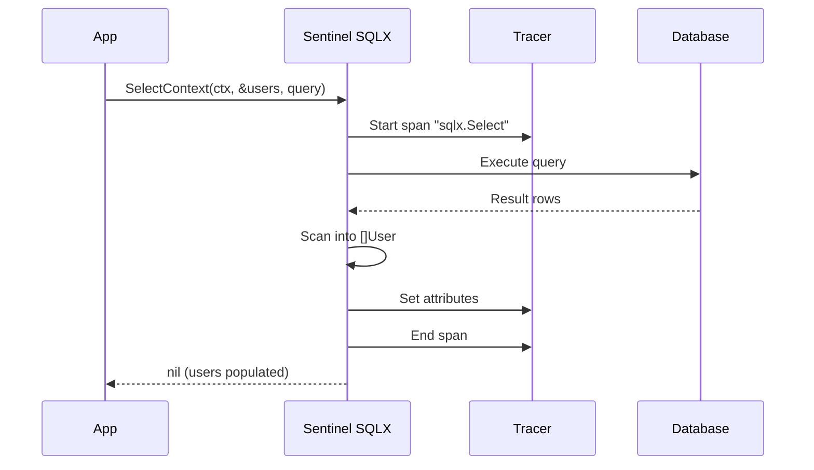

---

## SQLX Named Parameters

### The Problem: Positional Parameters

Positional parameters (`$1`, `$2`) are error-prone:

```go
// Which is $1? Which is $2? Easy to mess up!
db.Exec(`
    INSERT INTO users (name, email, age, city, country)
    VALUES ($1, $2, $3, $4, $5)
`, city, email, name, country, age)  // BUG: order is wrong!
```

As queries grow, this becomes unmaintainable:

- 10+ parameters? Good luck getting the order right
- Refactor the query? Must update all call sites
- Code review? Can't easily verify correctness

### The Solution: Named Parameters

Named parameters use `:name` syntax that's self-documenting:

```go
// Order doesn't matter - parameters matched by name
db.NamedExec(`
    INSERT INTO users (name, email, age, city, country)
    VALUES (:name, :email, :age, :city, :country)
`, map[string]any{
    "city":    city,     // Any order!
    "email":   email,
    "name":    name,
    "country": country,
    "age":     age,
})
```

### Using Structs (Best Practice)

Even better: use structs for type safety and IDE support:

```go
type CreateUserParams struct {
    Name    string `db:"name"`
    Email   string `db:"email"`
    Age     int    `db:"age"`
    City    string `db:"city"`
    Country string `db:"country"`
}

params := CreateUserParams{
    Name:    "John",
    Email:   "john@example.com",
    Age:     30,
    City:    "NYC",
    Country: "USA",
}

result, err := db.NamedExecContext(ctx, `
    INSERT INTO users (name, email, age, city, country)
    VALUES (:name, :email, :age, :city, :country)
`, params)
```

Benefits:

- **Type safety**: Compiler catches type mismatches
- **IDE support**: Autocomplete, refactoring
- **Documentation**: Struct is self-documenting
- **Reusability**: Use same struct for validation, API parsing

### How Named Binding Works

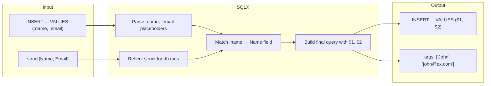

---

## SQLX Transactions

### The Problem: Transaction Boilerplate

Correct transaction handling requires careful boilerplate:

```go
// Manual transaction handling
tx, err := db.Begin()
if err != nil {
    return err
}

// Must remember to rollback on every error path!
_, err = tx.Exec("UPDATE accounts SET balance = balance - $1 WHERE id = $2", amount, from)
if err != nil {
    tx.Rollback()  // Easy to forget!
    return err
}

_, err = tx.Exec("UPDATE accounts SET balance = balance + $1 WHERE id = $2", amount, to)
if err != nil {
    tx.Rollback()  // Must repeat everywhere
    return err
}

return tx.Commit()
```

### The Solution: Defer Pattern with SQLX

```go
tx, err := db.BeginTxx(ctx, nil)
if err != nil {
    return err
}
defer tx.Rollback()  // Safe: no-op if already committed

_, err = tx.ExecContext(ctx, "UPDATE accounts SET balance = balance - $1 WHERE id = $2", amount, from)
if err != nil {
    return err  // Rollback called via defer
}

_, err = tx.ExecContext(ctx, "UPDATE accounts SET balance = balance + $1 WHERE id = $2", amount, to)
if err != nil {
    return err  // Rollback called via defer
}

return tx.Commit()  // Only reached on success
```

### Transaction Instrumentation

Every operation within a transaction is traced:

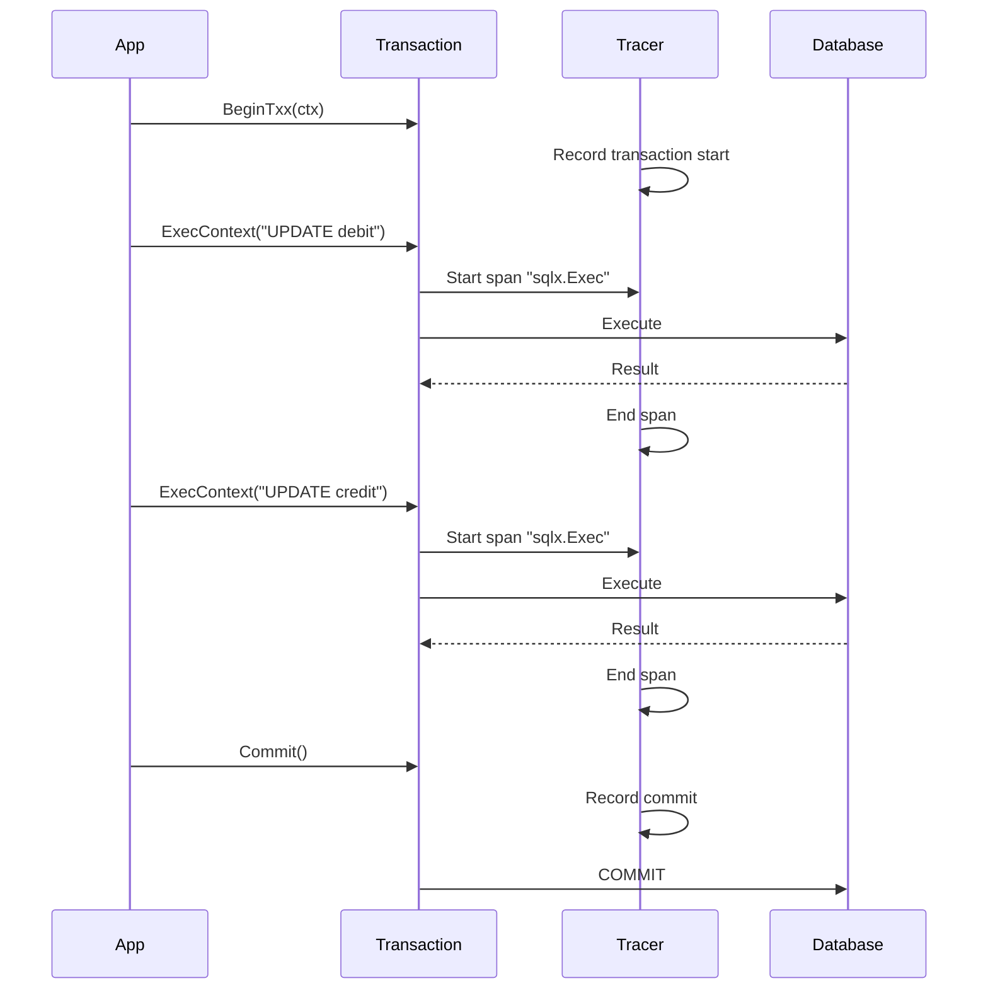

### Transaction Tracing Benefits

- See all queries within a transaction as a unit
- Identify slow transactions
- Debug transaction failures
- Track commit vs rollback ratio

---

# HTTPClient Package

## HTTPClient Overview

The `httpclient` package provides a production-ready HTTP client with built-in resilience patterns inspired by Google's SRE practices and Netflix's Hystrix.

### Design Principles

| Principle                | Implementation                               |
| ------------------------ | -------------------------------------------- |
| **Zero-config defaults** | Works out of the box                         |
| **Opt-in complexity**    | Advanced features available but not required |
| **Observability-first**  | All operations emit traces and metrics       |
| **Composition**          | Features can be combined independently       |

### Features Overview

| Feature              | What It Does                                 |
| -------------------- | -------------------------------------------- |
| **Circuit Breaker**  | Fail fast when downstream is unhealthy       |
| **Rate Limiter**     | Throttle request rate (global & per-request) |
| **Retry**            | Automatic recovery from transient failures   |
| **Hedging**          | Reduce tail latency with duplicate requests  |
| **Adaptive Hedging** | Self-tuning hedge delays                     |
| **Coalescing**       | Deduplicate simultaneous identical requests  |
| **Interceptors**     | Middleware for cross-cutting concerns        |
| **Mock Transport**   | Unit testing without actual network calls    |
| **Chaos Injection**  | Test resilience patterns                     |
| **Tracing/Metrics**  | Full observability                           |

---

## Transport Chain

### The Problem: Layered Resilience

Production HTTP clients need multiple resilience layers:

- Tracing (observability)
- Circuit breaking (isolation)
- Retry (recovery)
- Testing hooks (chaos)

But Go's `http.Client` only accepts one `Transport`. How do you layer them?

### The Solution: Transport Chain

Each resilience feature is implemented as an `http.RoundTripper` that wraps the next.

> [!NOTE]
> When using `WithMockTransport()`, this entire chain is replaced by the mock transport. This allows testing your application logic without triggering retries, rate limits, or network calls.

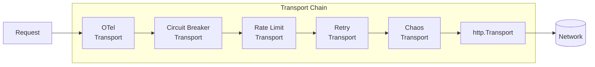

### Order Matters: Why This Sequence?

The order of transports is **critical** for correct behavior:

| Position        | Transport           | Why This Position?                                         |
| --------------- | ------------------- | ---------------------------------------------------------- |
| 1st (outermost) | **OTel**            | Traces the entire request lifecycle, including all retries |
| 2nd             | **Circuit Breaker** | Fails fast BEFORE wasting rate limit tokens                |
| 3rd             | **Rate Limit**      | Throttles acceptance of new requests (1 token = 1 request) |
| 4th             | **Retry**           | Retries transient failures from inner layers               |
| 5th             | **Chaos**           | Simulates failures that retry/breaker will see             |
| 6th (innermost) | **http.Transport**  | Actual network I/O                                         |

### Why Order Matters: Example

**Scenario**: Service is down, 3 retries configured, breaker threshold is 5 failures.

**Correct order (Breaker → Retry):**

```
Request 1: Retry 3 times, all fail. Breaker: 3 failures.
Request 2: Retry 3 times, all fail. Breaker: 6 failures → OPEN!
Request 3: Breaker rejects immediately. No network call.
```

**Wrong order (Retry → Breaker):**

```
Request 1:
  Attempt 1: Breaker failure #1
  Retry
  Attempt 2: Breaker failure #2
  Retry
  Attempt 3: Breaker failure #3

Request 2:
  Attempt 1: Breaker failure #4
  Retry
  Attempt 2: Breaker failure #5 → OPEN!

Now breaker is open, but we wasted 5 network calls instead of 2!
```

---

## Retry with Backoff

### The Problem: Transient Failures

Distributed systems experience transient failures constantly:

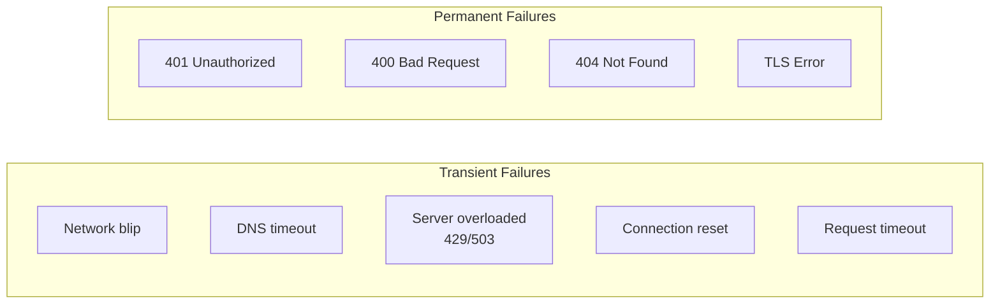

Without retry, every transient failure becomes a user-facing error. With retry, most succeed on the second attempt.

### How Retry Works

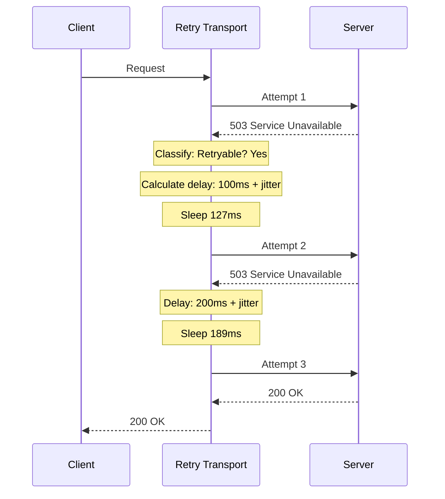

### Exponential Backoff with Jitter

**Exponential backoff** prevents overwhelming a recovering server:

```
Attempt 1: immediate
Attempt 2: 100ms delay
Attempt 3: 200ms delay
Attempt 4: 400ms delay
Attempt 5: 800ms delay
...up to maxDelay
```

**Jitter** prevents the "thundering herd" problem:

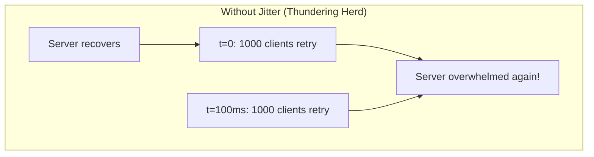

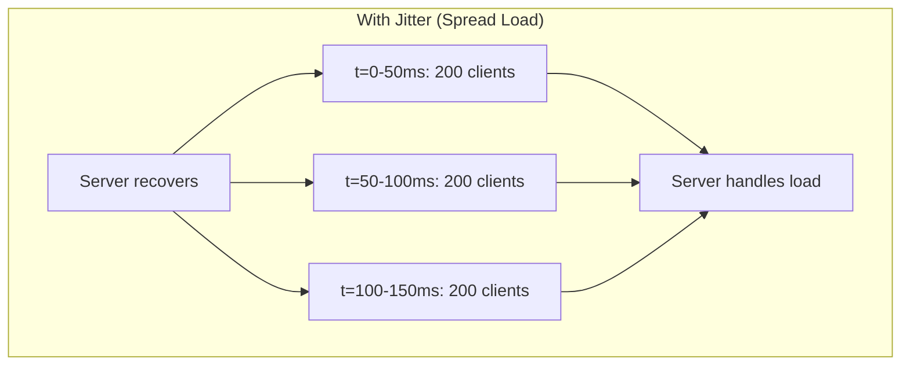

### Backoff Formula

```go
func calculateDelay(attempt int, config RetryConfig) time.Duration {
    // Exponential: baseDelay * (multiplier ^ attempt)
    delay := config.BaseDelay * time.Duration(math.Pow(config.Multiplier, float64(attempt)))

    // Cap at maximum
    if delay > config.MaxDelay {
        delay = config.MaxDelay
    }

    // Add jitter: random 0% to 100% of delay
    jitter := time.Duration(rand.Float64() * float64(delay) * config.JitterFactor)

    return delay + jitter
}
```

### Retry Classification

Not all errors should be retried:

| Error/Status                  | Retry? | Reasoning                        |
| ----------------------------- | ------ | -------------------------------- |
| **429 Too Many Requests**     | ✅     | Rate limited, will succeed later |
| **502 Bad Gateway**           | ✅     | Upstream temporarily unavailable |
| **503 Service Unavailable**   | ✅     | Server overloaded                |
| **504 Gateway Timeout**       | ✅     | Upstream slow                    |
| **Connection refused**        | ✅     | Server may be restarting         |
| **Connection reset**          | ✅     | Network hiccup                   |
| **DNS timeout**               | ✅     | Transient DNS issue              |
| **Request timeout**           | ✅     | Network congestion               |
| **400 Bad Request**           | ❌     | Client error, won't change       |
| **401 Unauthorized**          | ❌     | Auth issue, won't change         |
| **403 Forbidden**             | ❌     | Permission issue                 |
| **404 Not Found**             | ❌     | Resource doesn't exist           |
| **500 Internal Server Error** | ❌     | Server bug, not transient        |
| **TLS certificate error**     | ❌     | Security issue                   |
| **Context cancelled**         | ❌     | User cancelled request           |

### Configuration Presets

```go
// Default: Balanced for most services
DefaultRetryConfig()
// MaxRetries: 3, BaseDelay: 100ms, MaxDelay: 5s

// Aggressive: For critical paths
AggressiveRetryConfig()
// MaxRetries: 5, BaseDelay: 50ms, MaxDelay: 10s

// Conservative: For rate-limited APIs
ConservativeRetryConfig()
// MaxRetries: 2, BaseDelay: 200ms, MaxDelay: 2s

// Custom
WithRetryConfig(RetryConfig{
    MaxRetries:   5,
    BaseDelay:    100 * time.Millisecond,
    MaxDelay:     10 * time.Second,
    Multiplier:   2.0,
    JitterFactor: 0.5,
    Classifier:   myCustomClassifier,
})
```

---

## Circuit Breaker

### What Is a Circuit Breaker?

A circuit breaker is a design pattern that prevents an application from repeatedly trying to execute an operation that's likely to fail. Think of it like an electrical circuit breaker in your home—when there's an electrical fault, the breaker "trips" to prevent fire and damage. Similarly, a software circuit breaker "trips" when a downstream service is unhealthy.

### The Problem: Cascading Failures

In a microservices architecture, one failing service can bring down the entire system:

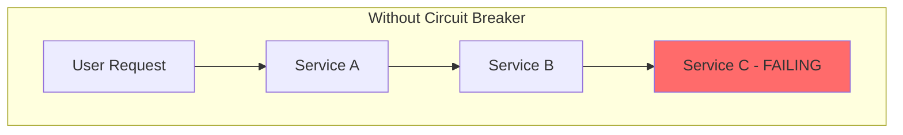

**What happens without a circuit breaker:**

1. **Service C starts failing** (overloaded, crashed, network issue)
2. **Service B keeps calling C**, waiting for timeouts (30s each)
3. **Service B's threads get exhausted** waiting for C
4. **Service A can't reach B** because B is stuck
5. **User requests pile up** across all services
6. **Entire system grinds to a halt** ❌

This is called a **cascading failure**—one bad service takes down everything.

### The Solution: Fail Fast

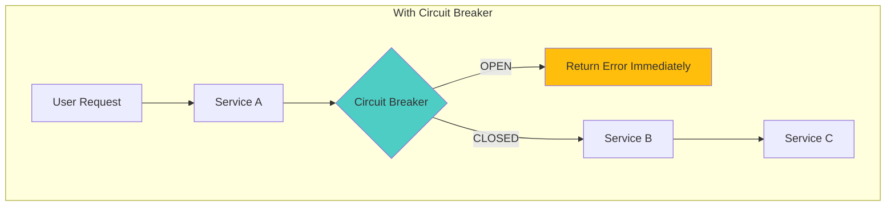

**What happens with a circuit breaker:**

1. **Service C starts failing**
2. **Circuit breaker detects failures** (e.g., 5 failures in 10 seconds)
3. **Circuit OPENS** → all requests immediately rejected
4. **No waiting for timeouts** → resources freed
5. **User gets fast error** (better than slow error!)
6. **Circuit tries to recover** after a timeout period

### State Machine Deep Dive

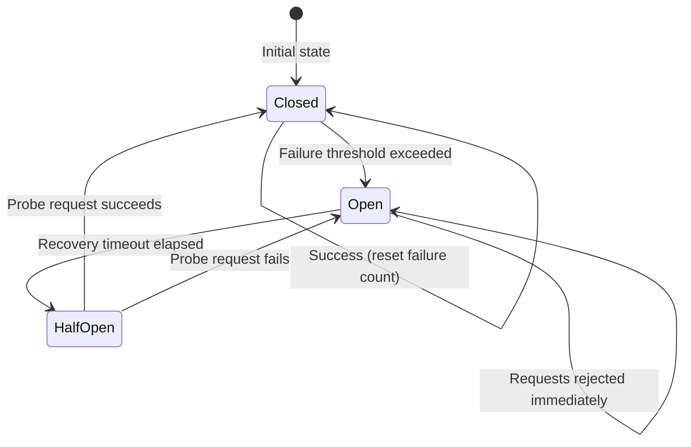

#### State: CLOSED (Normal Operation)

- All requests pass through normally
- Every failure increments a counter
- Failures within a time window are tracked
- When failure ratio exceeds threshold → **OPEN**

```go
// Example: Opens when 50% of requests fail in 10 seconds
BreakerConfig{
    FailureRatio:    0.5,        // 50% failure rate
    MinRequests:     10,         // Need at least 10 requests
    ConsecutiveFails: 5,         // Or 5 consecutive failures
}
```

#### State: OPEN (Protecting the System)

- **All requests immediately rejected** with `ErrOpenState`
- No network calls made
- Freed resources for healthy requests
- Stays open for a configured timeout

```go
// Requests return immediately with error
resp, err := client.Get(ctx, "/api/users")
// err = gobreaker.ErrOpenState (0ms, no network call)
```

#### State: HALF-OPEN (Testing Recovery)

- After timeout, allows **ONE probe request**
- If probe **succeeds** → CLOSED (service recovered!)
- If probe **fails** → OPEN (still broken)

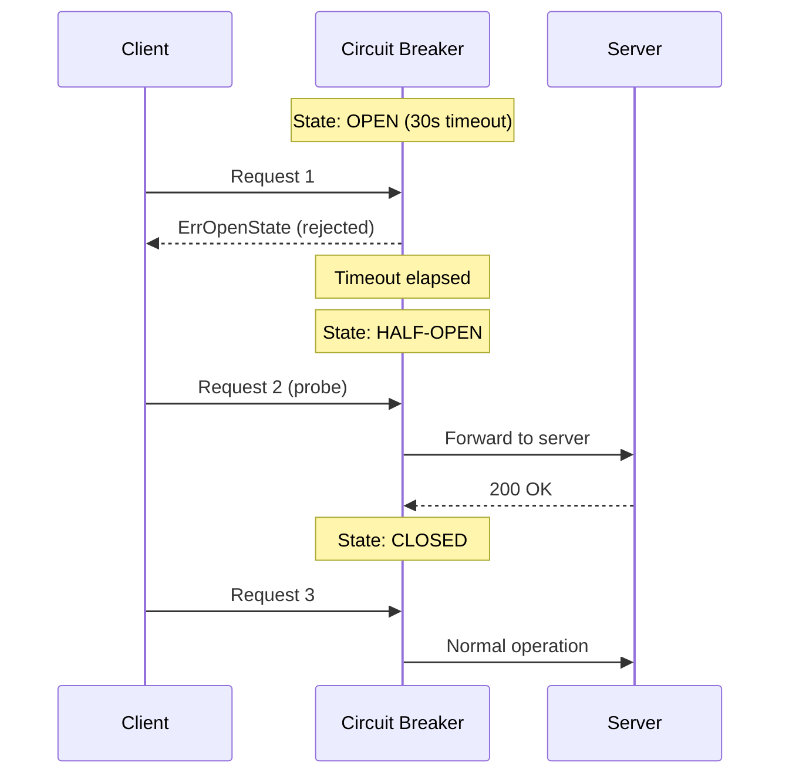

### Why This Matters: Real-World Impact

| Without Breaker                | With Breaker        |
| ------------------------------ | ------------------- |
| 30s timeout per failed request | 0ms rejection       |
| Threads blocked waiting        | Resources freed     |
| Cascading failures             | Isolated failures   |
| Slow degradation               | Fast error response |
| Manual intervention needed     | Auto-recovery       |

### Failure Classification

Not all errors should trip the breaker:

```go
// Default classifier
func DefaultBreakerClassifier(err error, resp *http.Response) bool {
    if resp != nil {
        switch resp.StatusCode {
        case 429, 502, 503, 504:
            return true  // Server overwhelmed
        }
    }
    if errors.Is(err, context.Canceled) {
        return false  // User cancelled, not server fault
    }
    return true  // Other errors count as failures
}
```

### Distributed Circuit Breaker

In a multi-instance deployment, each instance has its own circuit breaker. This can lead to problems:

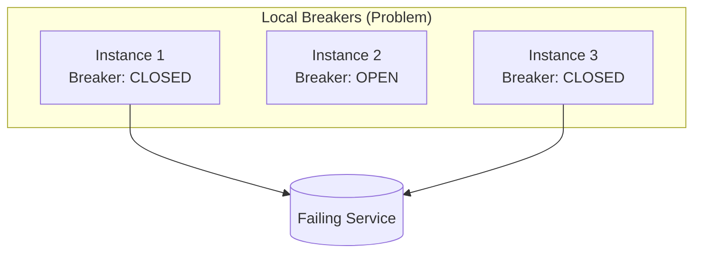

**Solution: Share state via Redis**

```go
// All instances share breaker state
client := httpclient.New(
    httpclient.WithCircuitBreaker(
        httpclient.DistributedBreakerConfig(redisClient),
    ),
)
```

Benefits:

- One instance can trip the breaker for all
- Faster failure detection
- Coordinated recovery

---

## Hedged Requests

### What Is Hedging?

Hedging is the practice of sending duplicate requests when the original is taking too long. The first response wins, and the slower requests are cancelled. This technique is named after financial hedging—reducing risk by placing multiple "bets."

### The Problem: Tail Latency

In any system, latency follows a distribution. While the median (P50) might be 50ms, the P99 (99th percentile) could be 500ms or more:

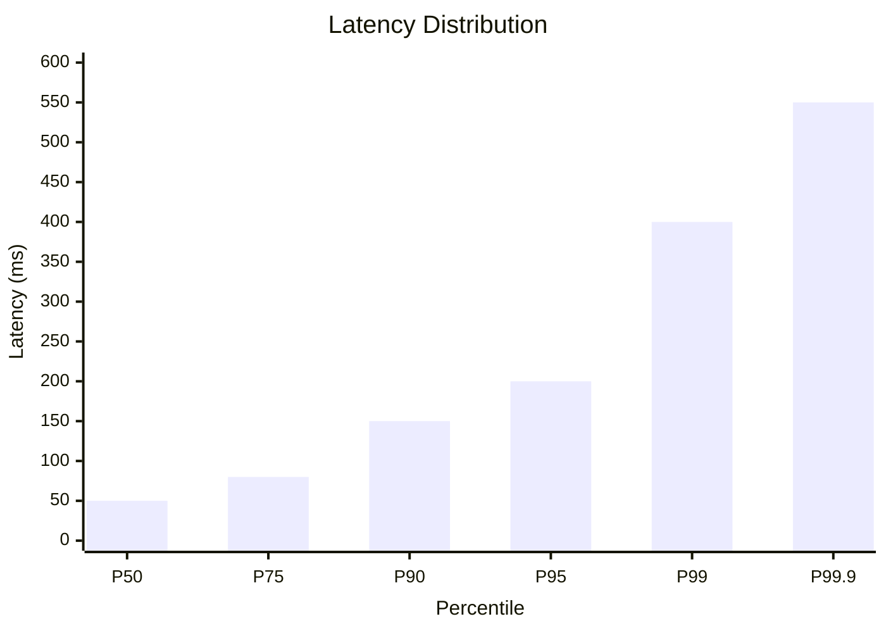

**Why does tail latency matter?**

1. **User experience**: Even if 99% of requests are fast, 1% being slow is noticeable
2. **Fan-out amplification**: If one page loads data from 10 services, the slowest one dominates
3. **Real impact**: At Google scale (billions of requests), 1% means millions of slow requests daily

### The Insight: "The Tail at Scale"

Google's seminal paper "[The Tail at Scale](https://research.google/pubs/pub40801/)" explains:

> "A simple way to curb latency variability is to issue the same request to multiple replicas and use whichever responds first."

### How Hedging Works

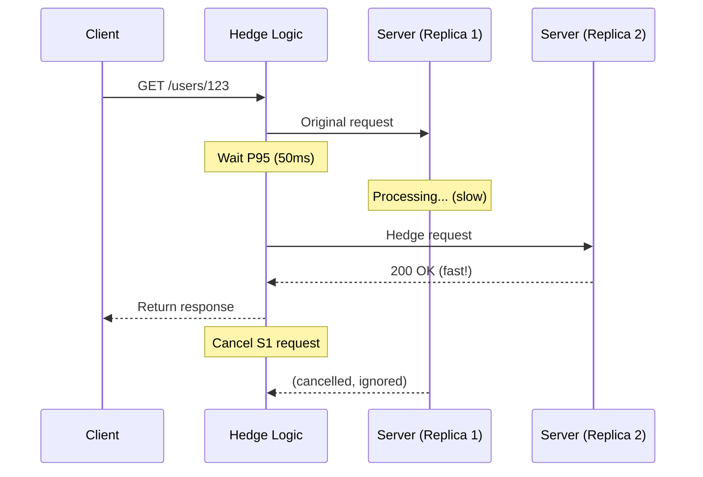

### The Key Insight: P95 as Hedge Delay

Setting the hedge delay to your P95 latency means:

- **95% of requests** complete before hedge is sent (zero overhead)
- **5% of slow requests** get a second chance
- **Net effect**: P99 drops dramatically

```
Before hedging:
  P50: 50ms, P95: 200ms, P99: 500ms

After hedging (delay=200ms):
  P50: 50ms, P95: 200ms, P99: ~220ms  ← Major improvement!
```

### Mathematical Intuition

If request latency is random, the probability that the first of N requests exceeds time T is:

```
P(min(X1, X2, ..., Xn) > T) = P(X1 > T) * P(X2 > T) * ... * P(Xn > T)
```

For example, if P99 = 500ms (1% chance of exceeding):

- 1 request: 1% chance of > 500ms
- 2 requests: 0.01 \* 0.01 = 0.01% chance
- Effectively P99.99!

### Per-Request Configuration

Hedging is **per-request**, NOT client-level. This is critical:

```go
// ✅ SAFE: Hedge idempotent read
client.Request("GetUser").
    Hedge(50 * time.Millisecond).
    Get(ctx, "/users/123")

// ❌ DANGEROUS: Don't hedge writes!
client.Request("CreateOrder").
    Hedge(50 * time.Millisecond).  // BAD! Could create 2 orders
    Post(ctx, "/orders")

// ✅ SAFE: No hedging for write
client.Request("CreateOrder").
    Post(ctx, "/orders")
```

**Why per-request?**

1. Only idempotent operations should be hedged
2. Different endpoints have different P95s
3. Prevents accidental double-writes

### When to Use Hedging

| Use Case          | Hedge? | Reason                                  |
| ----------------- | ------ | --------------------------------------- |
| GET /users/123    | ✅     | Idempotent, safe to duplicate           |
| GET /search?q=foo | ✅     | Idempotent                              |
| POST /orders      | ❌     | Not idempotent, could create duplicates |
| PUT /users/123    | ⚠️     | Only if truly idempotent                |
| DELETE /items/456 | ⚠️     | Usually idempotent but verify           |

### Cost Considerations

Hedging increases load on downstream services:

```
Without hedging: 1 request per operation
With hedging: 1 + (P95+ requests × hedge probability)

Example: If 5% of requests exceed P95:
  Load increase = 1 + 0.05 × 1 = 1.05 (5% more requests)
```

This is usually acceptable because:

- Only slow requests trigger hedges (already stressed server)
- The latency improvement far outweighs the cost
- Cancelled requests consume minimal resources

---

## Adaptive Hedging

### The Problem with Static Hedging

Manual hedging requires knowing your P95 latency upfront:

```go
Hedge(50 * time.Millisecond)  // But how do I know it's 50ms?
```

Challenges:

- **New services** don't have historical data
- **Latency changes** over time (traffic patterns, deployments)
- **Different endpoints** have different characteristics
- **Guessing wrong** either adds overhead (too low) or provides no benefit (too high)

### The Solution: Adaptive Hedging

Adaptive hedging automatically learns the optimal hedge delay from historical request latencies:

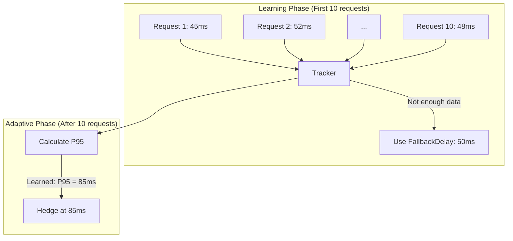

### Per-Endpoint Tracking

Each endpoint (identified by operation name) has its own latency tracker:

```go
// Tracks latency for "GetUser" endpoint
client.Request("GetUser").
    AdaptiveHedge(cfg).
    Get(ctx, "/users/123")

// Separately tracks latency for "GetProducts" endpoint
client.Request("GetProducts").
    AdaptiveHedge(cfg).
    Get(ctx, "/products")
```

This matters because different endpoints have vastly different latencies:

- `GetUser`: P95 = 50ms (cached)
- `SearchProducts`: P95 = 500ms (complex query)

### How the Tracker Works

The tracker uses a **circular buffer** to store recent latency samples:

```mermaid
flowchart LR
    subgraph Buffer["Circular Buffer (100 samples)"]
        direction LR
        S1[45ms]
        S2[52ms]
        S3[48ms]
        S4[...]
        S100[51ms]
    end

    NEW[New: 55ms] --> |"Overwrites oldest"| S1

    subgraph Percentile["P95 Calculation"]
        Buffer --> SORT["Sort: 45, 46, 47, ..., 120"]
        SORT --> IDX["Index = 99 × 0.95 = 94"]
        IDX --> P95["P95 = samples[94] = 85ms"]
    end
```

**Algorithm:**

1. Store up to `WindowSize` (default: 100) samples
2. When calculating percentile:
   - Copy samples
   - Sort ascending
   - Return value at index `(len - 1) × percentile`

### Configuration Options

```go
AdaptiveHedgeConfig{
    TargetPercentile: 0.95,              // Calculate P95
    WindowSize:       100,               // Keep 100 samples
    MinSamples:       10,                // Need 10 before adapting
    FallbackDelay:    50 * time.Millisecond,  // Use until enough data
    MaxHedges:        1,                 // One hedge request
}
```

| Option             | Default | Description                      |
| ------------------ | ------- | -------------------------------- |
| `TargetPercentile` | 0.95    | Which percentile to target       |
| `WindowSize`       | 100     | Samples to keep per endpoint     |
| `MinSamples`       | 10      | Minimum before adaptive kicks in |
| `FallbackDelay`    | 50ms    | Delay when insufficient data     |
| `MaxHedges`        | 1       | Maximum hedge requests           |

### Cold Start Behavior

New endpoints start with `FallbackDelay` until enough samples are collected:

```
Request 1-9:   Use FallbackDelay (50ms)
Request 10+:  Use calculated P95 (e.g., 85ms)
```

This ensures hedging works immediately while the system learns.

---

## Chaos Injection

### What Is Chaos Engineering?

Chaos engineering is the discipline of experimenting on a system to build confidence in its ability to withstand turbulent conditions in production. Made famous by Netflix's Chaos Monkey, it answers the question: "Does my system actually handle failures correctly?"

### The Problem: Untested Resilience

You've implemented retry, circuit breaker, hedging. But have you tested them?

```go
// You wrote this code...
client := httpclient.New(
    httpclient.WithRetryConfig(...),
    httpclient.WithCircuitBreaker(...),
)

// But does it actually work?
// - Does retry really retry on 503?
// - Does the breaker actually trip after N failures?
// - Does hedging kick in when requests are slow?
```

**Without chaos testing**, you're relying on:

- Hope that your code is correct
- Production outages as your "test suite"
- Manual testing that's incomplete

### The Solution: Controlled Failure Injection

Chaos injection lets you simulate failures in a controlled environment:

```go
// Development/Testing: Enable chaos
client := httpclient.New(
    httpclient.WithRetryConfig(DefaultRetryConfig()),
    httpclient.WithChaos(ChaosConfig{
        ErrorRate: 0.1,  // 10% of requests fail
    }),
)

// Now run your tests - retry logic WILL be exercised!
```

### Injection Types

| Type        | What It Does                 | What It Tests               |
| ----------- | ---------------------------- | --------------------------- |
| **Latency** | Adds configurable delay      | Timeouts, hedging triggers  |
| **Error**   | Returns network error        | Retry logic, error handling |
| **Timeout** | Waits until context deadline | Deadline handling, cleanup  |

### How Chaos Transport Works

```mermaid
flowchart TB
    REQ[Incoming Request] --> CHECK{Chaos Enabled?}

    CHECK --> |No| PASS[Normal Execution]

    CHECK --> |Yes| ROLL[Roll Random 0.0-1.0]

    ROLL --> ERR{"random < ErrorRate?"}
    ERR --> |Yes| FAIL[Return ErrChaosInjected]

    ERR --> |No| TO{"random < TimeoutRate?"}
    TO --> |Yes| WAIT[Wait for ctx.Done]

    TO --> |No| LAT{"LatencyMs > 0?"}
    LAT --> |Yes| SLEEP[Sleep LatencyMs ± Jitter]

    LAT --> |No| PASS
    SLEEP --> PASS
```

### Configuration Examples

```go
// Scenario 1: Test retry logic
// 30% of requests fail with network error
httpclient.WithChaos(httpclient.ChaosConfig{
    ErrorRate: 0.3,
})

// Scenario 2: Test timeout handling
// 10% of requests hang until deadline
httpclient.WithChaos(httpclient.ChaosConfig{
    TimeoutRate: 0.1,
})

// Scenario 3: Test hedging
// Add 100-150ms latency (triggers hedges set at 50ms)
httpclient.WithChaos(httpclient.ChaosConfig{
    LatencyMs:       100,
    LatencyJitterMs: 50,
})

// Scenario 4: Realistic failure mix
httpclient.WithChaos(httpclient.ChaosConfig{
    LatencyMs:       50,
    LatencyJitterMs: 25,
    ErrorRate:       0.05,
    TimeoutRate:     0.02,
})
```

### Position in Transport Chain

Chaos transport is placed **innermost** (closest to http.Transport):

```
Request → OTel → Breaker → Retry → Chaos → http.Transport
```

**Why innermost?**

- **Circuit breaker sees chaos failures** → can trip on simulated errors
- **Retry retries chaos failures** → exercises retry logic
- **Hedging responds to chaos delays** → triggers hedged requests

If chaos were outermost, it would bypass all resilience layers.

### Chaos Testing Best Practices

| ✅ Do                                 | ❌ Don't                        |
| ------------------------------------- | ------------------------------- |
| Enable in test/staging environments   | Enable in production by default |
| Use realistic failure rates (1-10%)   | Use 100% failure rates          |
| Test specific scenarios one at a time | Combine all chaos types at once |
| Document expected behavior            | Hope for the best               |
| Automate chaos tests in CI            | Only run manually               |

### Example: Testing Retry Logic

```go
func TestRetryOnServerError(t *testing.T) {
    var attempts int32

    server := httptest.NewServer(http.HandlerFunc(func(w http.ResponseWriter) {
        atomic.AddInt32(&attempts, 1)
        w.WriteHeader(http.StatusOK)  // Always succeed
    }))

    client := httpclient.New(
        httpclient.WithBaseURL(server.URL),
        httpclient.WithRetryConfig(httpclient.RetryConfig{MaxRetries: 3}),
        httpclient.WithChaos(httpclient.ChaosConfig{
            ErrorRate: 1.0,  // 100% failure on first N-1 attempts
        }),
    )

    resp, err := client.Get(ctx, "/test")

    // Should have retried until success
    assert.NoError(t, err)
    assert.GreaterOrEqual(t, atomic.LoadInt32(&attempts), int32(1))
}
```

---

## Request Coalescing

### The Problem: Cache Stampedes

When a popular resource (like a config file or a trending user profile) expires from the cache, dozens or hundreds of concurrent requests might hit your application simultaneously. If your client simply forwards all these requests to the origin, you create a "thundering herd" or "cache stampede."

```mermaid
graph LR
    User1[User 1] -->|GET /config| Client
    User2[User 2] -->|GET /config| Client
    User3[User 3] -->|GET /config| Client
    Client -- 3 requests --> Origin[Origin Server]
```

This spikes load on your downstream services and database, potentially causing outages.

### The Solution: Singleflight

Request Coalescing (also known as "request collapsing" or "singleflight") ensures that for any given key (e.g., method + URL), **only one** flight is in the air at a time. The first request initiates the network call, and all subsequent identical requests "latch on" to that in-flight request. When the response arrives, it is shared with all waiting callers.

```mermaid
graph LR
    User1[User 1] -->|GET /config| Client
    User2[User 2] -->|GET /config| Client
    User3[User 3] -->|GET /config| Client
    Client -- 1 Request (Shared) --> Origin[Origin Server]
```

**Key Characteristics:**

- **Simultaneous Only**: This is NOT caching. Once the request finishes, the next request will make a fresh network call. This guarantees no stale data problems.
- **Transparent**: The caller doesn't know (or care) that their request was coalesced.
- **Fail Together**: If the shared request fails, all waiting callers receive the same error.

### Implementation

We use `golang.org/x/sync/singleflight` under the hood. The `EnableCoalesce()` option activates this behavior per-request.

```go
resp, err := client.Request("GetConfig").
    Coalesce(). // Enable coalescing
    Get(ctx, "/config.json")
```

---

## Rate Limiting

### Dual-Layer Protection

A robust client needs to respect limits at two levels:

1.  **Client Level (Global)**: Protects your application's total outbound bandwidth and resource usage. For example, "this service should not make more than 1000 RPS to _any_ external dependencies combined."
2.  **Request Level (Endpoint)**: Respects specific API limits of downstream services. For example, "the `/bulk-export` endpoint allows only 5 RPS."

### Token Bucket Algorithm

We use the Token Bucket algorithm (via `golang.org/x/time/rate`).

- **Tokens** are added to the bucket at a fixed rate (RPS).
- **Requests** consume tokens.
- **Burst** size determines how many tokens can pile up for sudden spikes.

If the bucket is empty, the request can either **Wait** (block until a token is available) or **Fail Fast** (return `ErrRateLimited` immediately).

### Configuration

**Global Client Limit:**

```go
client := httpclient.New(
    httpclient.WithRateLimit(httpclient.RateLimitConfig{
        RequestsPerSecond: 100,
        Burst:             20,
        WaitOnLimit:       true, // Wait for available token
    }),
)
```

**Per-Request Limit:**

```go
// Enforce strict 10 RPS for this specific heavy endpoint
resp, err := client.Request("HeavyJob").
    RateLimit(10).
    Get(ctx, "/jobs/heavy")
```

---

## Interceptors

Interceptors provide a powerful middleware pattern for cross-cutting concerns. They form a chain around the request execution, allowing you to inspect, modify, or halt requests and responses.

### Execution Flow

```
Request ──▶ [ Interceptor 1 ] ──▶ [ Interceptor 2 ] ──▶ [ Network Call ]
                                                              │
Response ◀── [ Interceptor 1 ] ◀── [ Interceptor 2 ] ◀────────┘
```

### Order of Operations

1.  **Client Request Interceptors**: Global interceptors defined at client creation.
2.  **Per-Request Interceptors**: Specific interceptors added via `.Intercept()`.
3.  **Network Call**: The actual HTTP transport (including retries, hedging, etc.).
4.  **Response Interceptors**: Post-processing hooks.

### Common Use Cases

**1. Authentication:**

```go
// Add Bearer token to all requests
client := httpclient.New(
    httpclient.WithRequestInterceptor(
        httpclient.AuthBearerInterceptor("my-secret-token"),
    ),
)
```

**2. Distributed Tracing / Correlation IDs:**

```go
// Propagate Request-ID from incoming context to outgoing request
func CorrelationIDInterceptor(next *http.Request) error {
    if id := ctx.Value("request_id"); id != nil {
        next.Header.Set("X-Request-ID", id.(string))
    }
    return nil
}
```

**3. Logging & Metrics:**
Logging request details or capturing custom metrics before/after execution.

---

## Testing with Mock Transport

Testing code that depends on `http.Client` is often painful. You either mock the entire client interface (losing the benefit of testing your client configuration) or spin up a real HTTP server (slow, flaky).

The `MockTransport` solves this by replacing the _network layer_ while keeping the rest of the client stack (interceptors, rate limiters, retries) intact.

### How it Works

The mock transport sits at the bottom of the transport chain. Instead of making a syscall, it matches the request against a list of stubs and returns a predefined response.

### Usage Example

```go
// 1. Create a client with MockTransport
client := httpclient.New(
    httpclient.WithMockTransport(),
)

// 2. Access the mock to define behavior
mock := client.Mock()

// 3. Stub a response
mock.OnRequest(http.MethodGet, "https://api.example.com/users").
    Return(http.StatusOK, `{"users": ["alice", "bob"]}`)

// 4. Run your code
users, err := myService.GetUsers(ctx)

// 5. Verify expectations
assert.NoError(t, err)
assert.Equal(t, 2, len(users))
```

This approach allows you to test:

- **Middleware**: Are your interceptors adding headers correctly?
- **Resilience**: Does your retry logic handle 503s correctly? (Stub a 503, then a 200).
- **Parsers**: Does your JSON decoding struct match the API response format?

---

## Observability

### Metrics Overview

The HTTPClient emits OpenTelemetry metrics for all operations:

| Metric                                 | Type      | Labels               | What It Measures                             |
| -------------------------------------- | --------- | -------------------- | -------------------------------------------- |
| `http.client.request.duration`         | Histogram | method, status, host | End-to-end request latency                   |
| `http.client.retry.attempts`           | Counter   | method, host         | Total retry attempts                         |
| `http.client.retry.exhausted`          | Counter   | method, host         | Retries that gave up                         |
| `http.client.circuit_breaker.state`    | Gauge     | name                 | Current state (0=Closed, 1=HalfOpen, 2=Open) |
| `http.client.circuit_breaker.requests` | Counter   | name, result         | Requests by outcome                          |
| `http.client.dns.duration`             | Histogram | host                 | DNS lookup time                              |
| `http.client.tls.duration`             | Histogram | host                 | TLS handshake time                           |

### Trace Structure

Each HTTP request creates a span with rich context:

```
[Span: HTTP GET https://api.example.com/users/123]
├── Attributes
│   ├── http.method: GET
│   ├── http.url: https://api.example.com/users/123
│   ├── http.status_code: 200
│   ├── http.retry.count: 2
│   ├── net.peer.name: api.example.com
│   ├── net.peer.port: 443
│   └── http.response.body.size: 1234
│
├── Events
│   ├── [t=0ms] retry.attempt: {attempt: 1, status: 503}
│   ├── [t=5ms] retry.backoff: {duration: 127ms}
│   ├── [t=132ms] retry.attempt: {attempt: 2, status: 503}
│   ├── [t=137ms] retry.backoff: {duration: 189ms}
│   └── [t=326ms] retry.attempt: {attempt: 3, status: 200}
│
└── Duration: 350ms
```

### Using Traces for Debugging

Traces answer questions like:

- Why was this request slow? (see retry events)
- Is the circuit breaker tripping? (span rejected by breaker)
- What's the connection overhead? (DNS + TLS durations)
- How many retries happened? (http.retry.count attribute)

---

## Summary

| Package        | Purpose                   | Key Features                                       |
| -------------- | ------------------------- | -------------------------------------------------- |
| **sql**        | Instrumented database/sql | Driver wrapping, tracing, query sanitization       |
| **sqlx**       | Instrumented jmoiron/sqlx | Struct scanning, named params, transaction tracing |
| **httpclient** | Resilient HTTP client     | Retry, circuit breaker, hedging, chaos             |

| httpclient Feature   | Problem Solved         | Key Benefit                           |
| -------------------- | ---------------------- | ------------------------------------- |
| **Retry**            | Transient failures     | Automatic recovery with smart backoff |
| **Circuit Breaker**  | Cascading failures     | Fail fast, protect system resources   |
| **Hedging**          | Tail latency           | Reduce P99 by ~10x                    |
| **Adaptive Hedging** | Unknown P95            | Self-tuning hedge delays              |
| **Chaos**            | Untested resilience    | Safe failure simulation               |
| **Coalescing**       | Cache stampedes        | Deduplicate concurrent requests       |
| **Rate Limiting**    | API rate limits        | Client-side throttling                |
| **Interceptors**     | Cross-cutting concerns | Auth, logging, metrics middleware     |
| **Mock Transport**   | Testing complexity     | Unit test without network calls       |
| **Observability**    | Invisible failures     | Full traces and metrics               |
