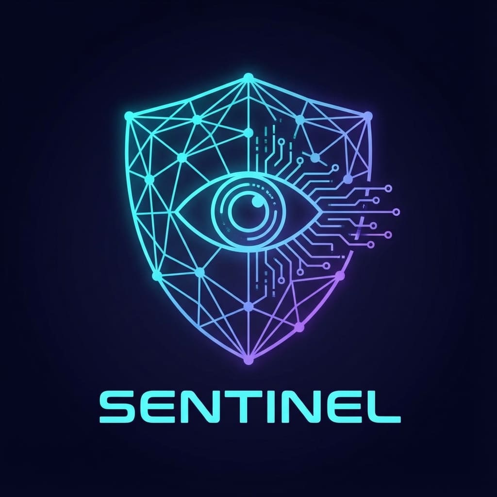

<div align="center">
  
  <h1>Sentinel-Go</h1>
  <p>
    <b>The Opinionated, Production-Ready OpenTelemetry Wrapper for Go.</b>
  </p>

[](https://pkg.go.dev/github.com/kroma-labs/sentinel-go)
[](https://goreportcard.com/report/github.com/kroma-labs/sentinel-go)
[](LICENSE)

</div>

---

**Sentinel-Go** provides drop-in, zero-config OpenTelemetry instrumentation for your Go applications. It wraps standard libraries (like `database/sql`) to strictly enforce observability best practices, ensuring your logs, metrics, and traces are production-ready from day one.

## ✨ Features

- **🛡️ Secure by Design**: Automatic sanitization of SQL queries to prevent PII leakage.
- **🔌 Drop-in Replacement**: Compatible with standard library interfaces (`*sql.DB`).
- **📊 Rich Telemetry**:
  - **Tracing**: Full span hierarchy with semantic conventions (`db.system`, `db.operation`).
  - **Metrics**: Standardized histograms for query latency and connection pool gauges.
- **🧩 Modular**: Import only what you need (e.g., `sentinel-go/sql`).

## 📦 Installation

```bash
go get github.com/kroma-labs/sentinel-go
```

## 🚀 Quick Start: SQL

Use `sentinelsql` as a replacement for `sql.Open`. It returns a standard `*sql.DB`.

```go
import (
    "context"
    sentinelsql "github.com/kroma-labs/sentinel-go/sql"
    _ "github.com/lib/pq" // Import your driver as usual
)

func main() {
    // 1. Open Connection with Sentinel
    // Automatically wraps the driver with OTel instrumentation
    db, err := sentinelsql.Open("postgres", "postgres://...",
        sentinelsql.WithDBSystem("postgresql"),
        sentinelsql.WithDBName("main_db"),
    )
    if err != nil {
        panic(err)
    }
    defer db.Close()

    // 2. Register Connection Pool Metrics (Optional)
    // Tracks Open/Idle/Max connections and Wait times
    // Auto-detects attributes from the driver!
    sentinelsql.RecordPoolMetrics(db, otel.GetMeterProvider().Meter("myapp"))

    // 3. Use standard *sql.DB methods
    // Context is REQUIRED for tracing propagation
    db.QueryContext(ctx, "SELECT * FROM users WHERE id = $1", 123)
}
```

## 🚀 Quick Start: SQLX

Use `sentinelsqlx` for `jmoiron/sqlx` with full struct scanning support.

```go
import (
    "context"
    sentinelsqlx "github.com/kroma-labs/sentinel-go/sqlx"
    _ "github.com/lib/pq"
)

type User struct {
    ID   int    `db:"id"`
    Name string `db:"name"`
}

func main() {
    // 1. Open Connection with Sentinel SQLX
    db, err := sentinelsqlx.Open("postgres", "postgres://...",
        sentinelsqlx.WithDBSystem("postgresql"),
        sentinelsqlx.WithDBName("main_db"),
    )
    if err != nil {
        panic(err)
    }
    defer db.Close()

    // 2. Use sqlx methods - all instrumented!
    var user User
    db.GetContext(ctx, &user, "SELECT * FROM users WHERE id = $1", 1)

    var users []User
    db.SelectContext(ctx, &users, "SELECT * FROM users")

    // 3. Transactions with tracing
    tx, _ := db.BeginTxx(ctx, nil)
    tx.ExecContext(ctx, "INSERT INTO users (name) VALUES ($1)", "John")
    tx.Commit()
}
```

## ⚙️ Configuration Options

Customize behavior using functional options:

| Option               | Description                                                   | Example                               |
| -------------------- | ------------------------------------------------------------- | ------------------------------------- |
| `WithDBSystem`       | Sets the `db.system` attribute (required for OTel spec).      | `WithDBSystem("postgresql")`          |
| `WithDBName`         | Sets the `db.name` attribute.                                 | `WithDBName("users_db")`              |
| `WithInstanceName`   | Distinguish different instances (e.g., "primary", "replica"). | `WithInstanceName("read-replica-01")` |
| `WithDisableQuery`   | Disables recording the SQL query text in spans.               | `WithDisableQuery()`                  |
| `WithQuerySanitizer` | Custom function to sanitize SQL queries.                      | `WithQuerySanitizer(myFunc)`          |

## 🏗️ Modules

| Module           | Status     | Description                                        |
| ---------------- | ---------- | -------------------------------------------------- |
| [`sql`](./sql)   | ✅ Stable  | Wrapper for `database/sql` with tracing & metrics. |
| [`sqlx`](./sqlx) | ✅ Stable  | Wrapper for `jmoiron/sqlx` with tracing & metrics. |
| `http`           | 🚧 Planned | Instrumented HTTP Client/Server.                   |

## 🤝 Contributing

Contributions are welcome! Please check out the [example directory](./example) for runnable demos.

---

<div align="center">
  <sub>Built with ❤️ by Kroma Labs</sub>
</div>
