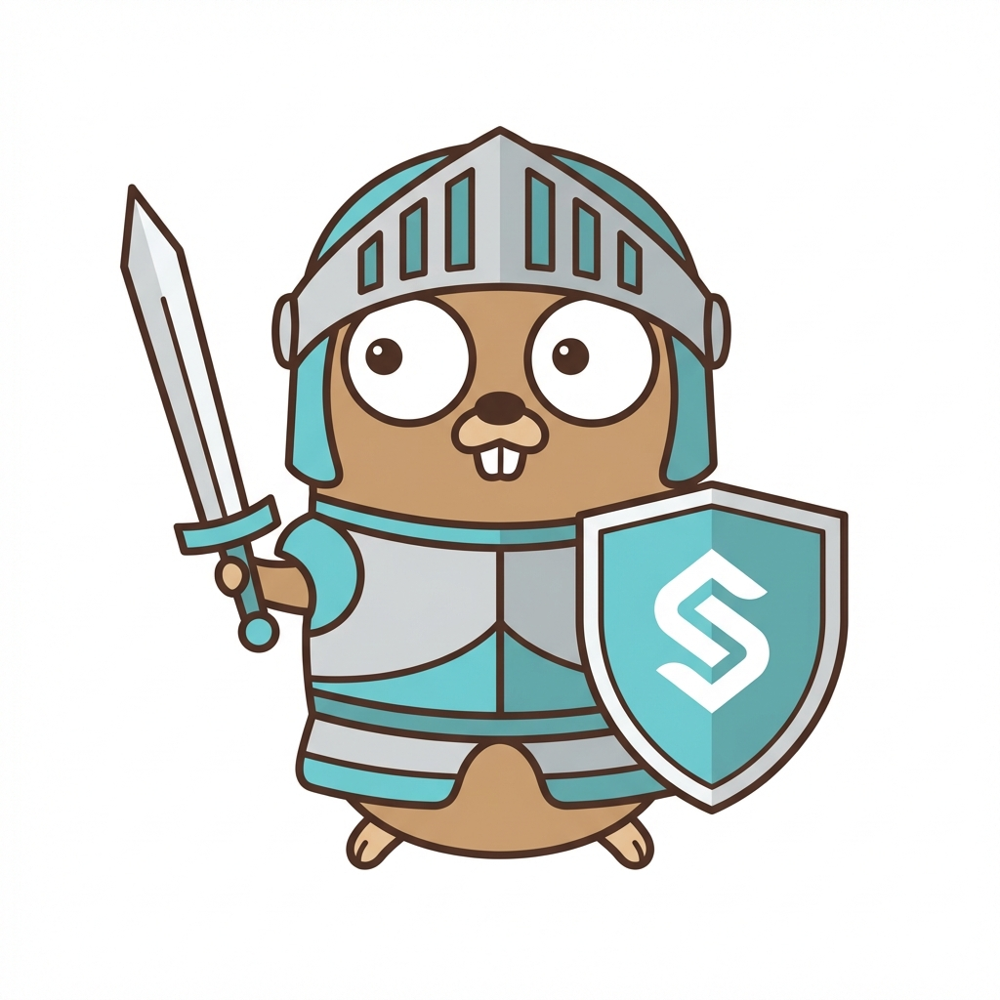

<div align="center">
  
  <h1>Sentinel-Go</h1>
  <p><b>Production-Ready Observability & Resilience for Go Applications</b></p>
  <p>
    <i>Stop wiring retries, circuit breakers, and traces manually.<br/>
    Sentinel-Go gives you battle-tested defaults that just work.</i>
  </p>

[](https://go.dev)
[](https://pkg.go.dev/github.com/kroma-labs/sentinel-go)
[](https://goreportcard.com/report/github.com/kroma-labs/sentinel-go)
[](LICENSE)
[](https://codecov.io/gh/kroma-labs/sentinel-go)

</div>

---

## Why Sentinel-Go?

Building reliable microservices in Go means handling a lot of cross-cutting concerns:

❌ **Without Sentinel-Go:**

- Manually configuring OpenTelemetry for every database query
- Copy-pasting retry logic with exponential backoff across services
- Implementing circuit breakers that may or may not work under load
- Inconsistent timeout configurations that cause cascading failures

✅ **With Sentinel-Go:**

- **Drop-in replacements** for `database/sql`, `sqlx`, and `net/http`
- **Production-tuned defaults** based on industry best practices (Hystrix, Google SRE)
- **Full observability** with traces and metrics out of the box
- **Resilience patterns** (retry, circuit breaker) that are battle-tested

```go
// One line. Full observability. Production-ready resilience.
client := httpclient.New(
    httpclient.WithServiceName("payment-api"),
    httpclient.WithRetryConfig(httpclient.DefaultRetryConfig()),
    httpclient.WithBreakerConfig(httpclient.DefaultBreakerConfig()),
)
```

---

## Table of Contents

- [Why Sentinel-Go?](#why-sentinel-go)
- [Table of Contents](#table-of-contents)
- [Installation](#installation)
- [Quick Start](#quick-start)
  - [SQL Wrapper](#sql-wrapper)
  - [SQLX Wrapper](#sqlx-wrapper)
  - [HTTP Client](#http-client)
- [HTTP Client Features](#http-client-features)
  - [Fluent Request Builder](#fluent-request-builder)
  - [Retry Configuration](#retry-configuration)
  - [Circuit Breaker](#circuit-breaker)
- [Configuration Reference](#configuration-reference)
  - [HTTP Transport Options](#http-transport-options)
  - [SQL/SQLX Options](#sqlsqlx-options)
- [Observability](#observability)
  - [Metrics Emitted](#metrics-emitted)
  - [Trace Attributes](#trace-attributes)
- [Roadmap](#roadmap)
- [Deep Dive](#deep-dive)
- [Contributing](#contributing)
- [License](#license)

---

## Installation

```bash
go get github.com/kroma-labs/sentinel-go
```

**Requirements:** Go 1.22+

---

## Quick Start

### SQL Wrapper

Drop-in replacement for `database/sql` with automatic tracing and metrics.

```go
import (
    sentinelsql "github.com/kroma-labs/sentinel-go/sql"
    _ "github.com/lib/pq"
)

func main() {
    db, err := sentinelsql.Open("postgres", "postgres://localhost/mydb",
        sentinelsql.WithDBSystem("postgresql"),
        sentinelsql.WithDBName("mydb"),
    )
    if err != nil {
        log.Fatal(err)
    }
    defer db.Close()

    // Use standard *sql.DB methods - all instrumented!
    db.QueryContext(ctx, "SELECT * FROM users WHERE id = $1", 123)
}
```

### SQLX Wrapper

Full support for `jmoiron/sqlx` with struct scanning.

```go
import (
    sentinelsqlx "github.com/kroma-labs/sentinel-go/sqlx"
    _ "github.com/lib/pq"
)

type User struct {
    ID   int    `db:"id"`
    Name string `db:"name"`
}

func main() {
    db, err := sentinelsqlx.Open("postgres", "postgres://localhost/mydb",
        sentinelsqlx.WithDBSystem("postgresql"),
        sentinelsqlx.WithDBName("mydb"),
    )
    if err != nil {
        log.Fatal(err)
    }

    var user User
    db.GetContext(ctx, &user, "SELECT * FROM users WHERE id = $1", 1)

    var users []User
    db.SelectContext(ctx, &users, "SELECT * FROM users LIMIT 10")
}
```

### HTTP Client

Production-ready HTTP client with retries, circuit breaker, and full observability.

```go
import "github.com/kroma-labs/sentinel-go/httpclient"

func main() {
    client := httpclient.New(
        httpclient.WithBaseURL("https://api.example.com"),
        httpclient.WithServiceName("my-service"),
    )

    // Simple GET
    resp, err := client.Request("GetUsers").Get(ctx, "/users")

    // POST with JSON body
    resp, err := client.Request("CreateUser").
        Body(map[string]string{"name": "John"}).
        Post(ctx, "/users")

    // With response decoding
    var user User
    resp, err := client.Request("GetUser").
        Decode(&user).
        Get(ctx, "/users/123")
}
```

---

## HTTP Client Features

### Fluent Request Builder

Build requests with a clean, chainable API:

```go
resp, err := client.Request("CreatePayment").
    Path("/payments").
    PathParam("id", "pay_123").           // URL path substitution
    Query("include", "items").            // Query parameters
    Header("X-Idempotency-Key", "abc").   // Custom headers
    Body(paymentRequest).                 // Auto-detect JSON/Form
    Decode(&response).                    // Auto-decode response
    Post(ctx)
```

### Retry Configuration

Pre-configured retry strategies with exponential backoff:

```go
// Default: 3 retries, 100ms-5s backoff
client := httpclient.New(
    httpclient.WithRetryConfig(httpclient.DefaultRetryConfig()),
)

// Aggressive: 5 retries, faster backoff
client := httpclient.New(
    httpclient.WithRetryConfig(httpclient.AggressiveRetryConfig()),
)

// Conservative: 2 retries, slower backoff
client := httpclient.New(
    httpclient.WithRetryConfig(httpclient.ConservativeRetryConfig()),
)

// Custom configuration
client := httpclient.New(
    httpclient.WithRetryConfig(httpclient.RetryConfig{
        MaxRetries:      5,
        InitialInterval: 200 * time.Millisecond,
        MaxInterval:     10 * time.Second,
        Multiplier:      2.0,
    }),
)
```

### Circuit Breaker

Prevent cascading failures with automatic circuit breaking:

```go
// Local circuit breaker (in-memory, per-instance)
client := httpclient.New(
    httpclient.WithServiceName("payment-api"),
    httpclient.WithBreakerConfig(httpclient.DefaultBreakerConfig()),
)

// Distributed circuit breaker (Redis-backed, shared across instances)
import "github.com/redis/go-redis/v9"

rdb := redis.NewClient(&redis.Options{Addr: "localhost:6379"})
store := httpclient.NewRedisStore(rdb)

client := httpclient.New(
    httpclient.WithServiceName("payment-api"),
    httpclient.WithBreakerConfig(httpclient.DistributedBreakerConfig(store)),
)
```

**Default Settings (Production-Tuned):**

| Setting               | Value | Description                           |
| --------------------- | ----- | ------------------------------------- |
| `ConsecutiveFailures` | 5     | Trip after 5 consecutive failures     |
| `FailureThreshold`    | 20    | Minimum requests before ratio applies |
| `FailureRatio`        | 0.5   | 50% failure rate trips breaker        |
| `Timeout`             | 10s   | Time in Open state before probing     |
| `Interval`            | 10s   | Reset window for failure counts       |

---

## Configuration Reference

### HTTP Transport Options

| Option                   | Description                      | Default           |
| ------------------------ | -------------------------------- | ----------------- |
| `WithConfig(cfg)`        | Full transport configuration     | `DefaultConfig()` |
| `WithServiceName(name)`  | Identifier for traces/metrics    | Required          |
| `WithBaseURL(url)`       | Base URL for requests            | -                 |
| `WithRetryConfig(cfg)`   | Retry configuration              | Disabled          |
| `WithBreakerConfig(cfg)` | Circuit breaker config           | Disabled          |
| `WithDefaultHeaders(h)`  | Default headers for all requests | -                 |
| `WithDebug(enabled)`     | Enable request/response logging  | `false`           |

### SQL/SQLX Options

| Option                   | Description            | Example                   |
| ------------------------ | ---------------------- | ------------------------- |
| `WithDBSystem(system)`   | Database type          | `"postgresql"`, `"mysql"` |
| `WithDBName(name)`       | Database name          | `"users_db"`              |
| `WithInstanceName(name)` | Instance identifier    | `"read-replica-01"`       |
| `WithDisableQuery()`     | Hide SQL in spans      | -                         |
| `WithQuerySanitizer(fn)` | Custom query sanitizer | -                         |

---

## Observability

### Metrics Emitted

**HTTP Client:**
| Metric | Type | Description |
|--------|------|-------------|
| `http.client.request.duration` | Histogram | Request latency |
| `http.client.circuit_breaker.state` | Gauge | 0=Closed, 1=HalfOpen, 2=Open |
| `http.client.circuit_breaker.requests` | Counter | Requests by result |

**SQL/SQLX:**
| Metric | Type | Description |
|--------|------|-------------|
| `db.client.query.duration` | Histogram | Query latency |
| `db.client.connections.open` | Gauge | Open connections |
| `db.client.connections.idle` | Gauge | Idle connections |

### Trace Attributes

All spans include semantic convention attributes:

- `http.method`, `http.url`, `http.status_code`
- `db.system`, `db.name`, `db.operation`
- `http.client.name` (service identifier)

---

## Roadmap

| Phase | Feature                            | Status      |
| ----- | ---------------------------------- | ----------- |
| 1     | SQL/SQLX Observability             | ✅ Complete |
| 2     | HTTP Client + Fluent Builder       | ✅ Complete |
| 3     | Retry & Circuit Breaker            | ✅ Complete |
| 4     | Chaos Injection, Hedged Requests   | ✅ Complete |
| 5     | Request Coalescing & Rate Limiting | ✅ Complete |
| 6     | Interceptors & Mock Transport      | ✅ Complete |
| 7     | HTTP Server Observability          | 🔜 Planned  |

---

## Deep Dive

For a comprehensive technical explanation of each feature, including architecture diagrams, algorithm details, and advanced usage patterns, see **[DEEP_DIVE.md](./DEEP_DIVE.md)**.

Topics covered:

- SQL driver wrapping and query sanitization
- Transport chain architecture
- Circuit breaker state machine
- Adaptive hedging algorithm
- Rate limiting strategies

---

## Contributing

Contributions are welcome! Check out the [example directory](./example) for runnable demos.

```bash
# Run tests
make test

# Run linter
make lint
```

---

## License

MIT License - see [LICENSE](LICENSE) for details.

---

<div align="center">
  <sub>Built with ❤️ by Kroma Labs</sub>
</div>
