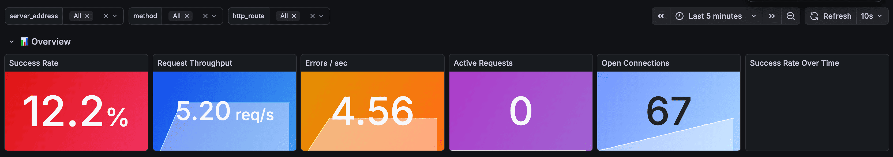
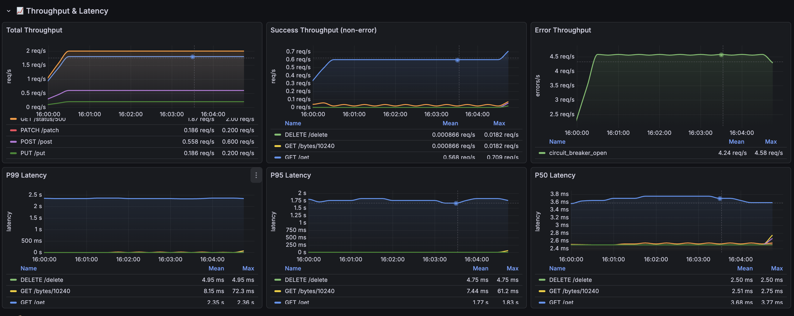
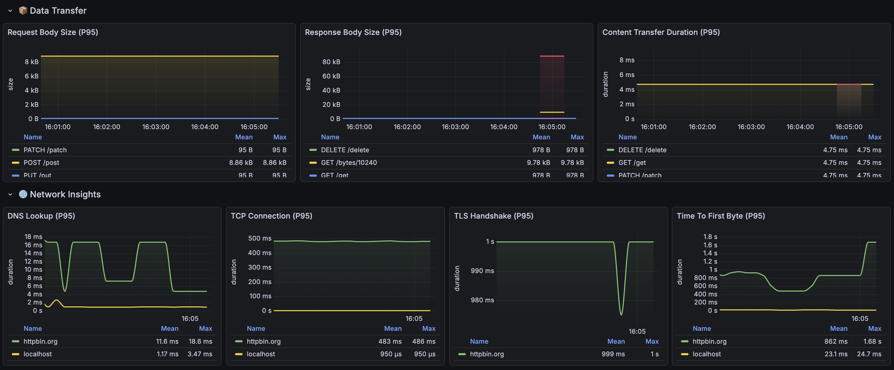
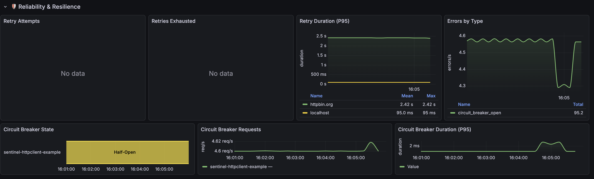

# HTTP Client Observability Example with Sentinel-Go

This directory contains a complete, self-contained example demonstrating how to instrument a Go HTTP client using `sentinel-go/httpclient` with **Tempo** (Distributed Tracing), **Prometheus** (Metrics), and **Grafana** (Visualization).

## 🚀 Quick Start

Get everything running in under 2 minutes.

### Prerequisites

- [Docker](https://docs.docker.com/get-docker/) & Docker Compose
- [Go](https://go.dev/dl/) 1.21 or newer

### 1. Start Infrastructure

We use Docker Compose to spin up:

- **httpbin**: Mock API for testing HTTP requests (port 8080)
- **Tempo**: Distributed tracing backend (port 4317 for OTLP)
- **Prometheus**: Time-series metrics database (port 9056)
- **Grafana**: Unified observability UI (port 3001)

```bash
cd example/httpclient
docker-compose -f deployments/docker-compose.yaml up -d
```

**Verify all services are running:**

```bash
docker-compose -f deployments/docker-compose.yaml ps
```

All services should show "Up" status. If any service is missing or unhealthy:

```bash
docker-compose -f deployments/docker-compose.yaml logs <service-name>  # Check logs
docker-compose -f deployments/docker-compose.yaml restart <service-name>  # Restart specific service
```

> **Note**: Wait 5-10 seconds for services to initialize. First startup takes longer (downloading images).

### 2. Run the Application

The application runs continuously and performs HTTP operations every 5 seconds:

```bash
# Using make (recommended)
make run

# Or build and run manually
go run cmd/client/main.go
```

You should see output like:

```text
✅ HTTP Client Example started!
📊 Prometheus metrics: http://localhost:2112/metrics
🔍 Grafana UI: http://localhost:3001
🌐 Mock API (httpbin): http://localhost:8080
Press Ctrl+C to stop...
📖 GetUsers: page=1, limit=10, origin=172.17.0.1
👤 GetUser: id=123, origin=172.17.0.1
✨ CreateUser: name=John Doe, email=john@example.com
...
✓ HTTP client operations completed
```

**Leave it running** to generate metrics and traces!

---

## 🌐 Service Access

| Service         | URL                           | Purpose                                      |
| --------------- | ----------------------------- | -------------------------------------------- |
| **Grafana**     | http://localhost:3001         | View traces and metrics (main UI)            |
| **Prometheus**  | http://localhost:9056         | Raw metrics queries                          |
| **App Metrics** | http://localhost:2112/metrics | Application metrics endpoint                 |
| **Tempo**       | http://localhost:3201         | Tempo API (backend only, use Grafana for UI) |
| **httpbin**     | http://localhost:8080         | Mock API for testing                         |

### Pre-built Dashboards

Grafana comes with a pre-configured dashboard:

**"Sentinel-Go: HTTP Client Metrics"** - Comprehensive view of:

- Request latency percentiles (P50, P95, P99)
- Request rate by HTTP method
- Error rate and active requests
- Circuit breaker state and requests
- Retry attempts and exhausted retries
- Network timing (DNS, TLS, Connection, TTFB)
- Request/Response body sizes

**Access**: Grafana Home → Dashboards → "Sentinel-Go: HTTP Client Metrics"









---

## ✨ Features Demonstrated

This example showcases all features of the `sentinel-go/httpclient` package:

### Client Configuration

```go
// Standard client with balanced configuration
client := httpclient.New(
    httpclient.WithBaseURL("http://localhost:8080"),
    httpclient.WithServiceName("sentinel-httpclient-example"),
    httpclient.WithRetryConfig(httpclient.RetryConfig{
        MaxRetries:    3,
        RetryOn5xx:    true,
    }),
    httpclient.WithBreakerConfig(httpclient.BreakerConfig{
        FailureThreshold: 3,
        SuccessThreshold: 2,
    }),
    httpclient.WithRateLimit(httpclient.RateLimitConfig{
        RequestsPerSecond: 100,
        Burst:             20,
    }),
)
```

### Configuration Presets

```go
// High throughput for bulk operations
highThroughputClient := httpclient.New(
    httpclient.WithConfig(httpclient.HighThroughputConfig()),
)

// Low latency for real-time APIs
lowLatencyClient := httpclient.New(
    httpclient.WithConfig(httpclient.LowLatencyConfig()),
)
```

### Fluent Request Building

```go
var users []User
resp, err := client.Request("GetUsers").
    Query("page", "1").
    Query("limit", "10").
    Decode(&users).
    Get(ctx, "/users")
```

### Hedging for Low Latency

```go
// Send hedge request after 50ms if original is slow
resp, err := client.Request("GetUser").
    Hedge(50 * time.Millisecond).
    Get(ctx, "/users/123")

// Adaptive hedging based on historical latency
resp, err := client.Request("GetUser").
    AdaptiveHedge(httpclient.AdaptiveHedgeConfig{
        TargetPercentile: 0.95,
        MinSamples:       10,
    }).
    Get(ctx, "/users/123")
```

### Request Coalescing

```go
// Deduplicate simultaneous identical requests
resp, err := client.Request("DeleteUser").
    Coalesce().
    Delete(ctx, "/users/456")
```

### Per-Request Rate Limiting

```go
// Different rate limits for different endpoints
resp, err := client.Request("BulkExport").
    RateLimit(10). // Only 10 req/s
    Get(ctx, "/exports")
```

### Request Tracing

```go
resp, err := client.Request("GetWithTrace").
    EnableTrace().
    Get(ctx, "/get")

trace := resp.TraceInfo()
fmt.Printf("DNS: %v, Connect: %v, TLS: %v, TTFB: %v\n",
    trace.DNSLookup, trace.ConnTime, trace.TLSTime, trace.TTFB)
```

### Interceptors

```go
// Per-request interceptor
resp, err := client.Request("AdminAction").
    Intercept(httpclient.APIKeyInterceptor("X-Admin-Token", token)).
    Post(ctx, "/admin/action")
```

---

## 🔍 What to Observe

### 1. Distributed Tracing (Grafana + Tempo)

Open [http://localhost:3001](http://localhost:3001)

**Navigate to Explore:**

1. Click **Explore** (compass icon) in the left sidebar
2. Select **Tempo** as the data source
3. Click **Search** tab
4. Set **Service Name** = `sentinel-httpclient-example`
5. Click **Run Query**

**Inspect Traces:**

- Click on any trace to see the timeline
- Parent span: `http-client-operations`
- Child spans: Individual HTTP requests (GET, POST, etc.)

**Span Attributes:**

- `http.request.method`: GET, POST, PUT, DELETE
- `url.full`: Full request URL
- `http.response.status_code`: Response status
- `http.client.name`: Service name

### 2. Metrics (Prometheus)

#### Raw Metrics Endpoint

Visit [http://localhost:2112/metrics](http://localhost:2112/metrics) to see raw metrics.

#### Prometheus UI

Open [http://localhost:9056](http://localhost:9056)

**Key Metrics to Query:**

**Request Duration:**

```promql
# Average request duration
rate(http_client_request_duration_seconds_sum[1m]) / rate(http_client_request_duration_seconds_count[1m])

# 95th percentile latency
histogram_quantile(0.95, rate(http_client_request_duration_seconds_bucket[1m]))
```

**Retry Metrics:**

```promql
# Retry attempts per minute
rate(http_client_retry_attempts_total[1m])

# Retries exhausted
rate(http_client_retry_exhausted_total[1m])
```

**Circuit Breaker:**

```promql
# Circuit breaker state (0=Closed, 1=HalfOpen, 2=Open)
http_client_circuit_breaker_state

# Breaker requests by result
rate(http_client_circuit_breaker_requests_total[1m])
```

---

## 📊 Metrics Reference

| Metric Name                               | Type      | Description                     |
| ----------------------------------------- | --------- | ------------------------------- |
| `http_client_request_duration_seconds`    | Histogram | Request latency in seconds      |
| `http_client_request_body_size_bytes`     | Histogram | Request body size in bytes      |
| `http_client_response_body_size_bytes`    | Histogram | Response body size in bytes     |
| `http_client_active_requests`             | Gauge     | In-flight requests              |
| `http_client_open_connections`            | Gauge     | Open connections                |
| `http_client_connection_duration_seconds` | Histogram | Connection establishment time   |
| `http_client_dns_duration_seconds`        | Histogram | DNS lookup time                 |
| `http_client_tls_duration_seconds`        | Histogram | TLS handshake time              |
| `http_client_ttfb_seconds`                | Histogram | Time to first byte              |
| `http_client_request_error_total`         | Counter   | Request errors by type          |
| `http_client_retry_attempts_total`        | Counter   | Retry attempts                  |
| `http_client_retry_exhausted_total`       | Counter   | Requests that exhausted retries |
| `http_client_retry_duration_seconds`      | Histogram | Time spent in retry loop        |
| `http_client_circuit_breaker_state`       | Gauge     | Breaker state (0/1/2)           |
| `http_client_circuit_breaker_requests`    | Counter   | Breaker requests by result      |

---

## 🧹 Cleanup

Stop and remove all containers:

```bash
docker-compose -f deployments/docker-compose.yaml down
```

---

## 🐛 Troubleshooting

### Error: "connection reset by peer" on port 4317

```
trace export: rpc error: code = Unavailable desc = connection error
```

**Cause**: Tempo service isn't running or unreachable.

**Solution**:

```bash
# Check if Docker services are running
docker-compose -f deployments/docker-compose.yaml ps

# If tempo is not running, restart
docker-compose -f deployments/docker-compose.yaml restart tempo

# Or restart all services
docker-compose -f deployments/docker-compose.yaml down && docker-compose -f deployments/docker-compose.yaml up -d
```

### Error: No metrics in Prometheus

**Cause**: Prometheus can't scrape the app on the host machine.

**Solution**:

- Verify the app is running and accessible at `http://localhost:2112/metrics`
- On macOS/Windows with Docker Desktop, `host.docker.internal` works automatically
- On Linux, update `prometheus.yml` to use `host.docker.internal` or your host IP

### Error: "connection refused" to httpbin

**Cause**: httpbin mock API isn't running.

**Solution**:

```bash
docker-compose -f deployments/docker-compose.yaml restart httpbin
```

---

## 💡 Tips

**Simulate circuit breaker opening:**

Stop the httpbin container to trigger failures:

```bash
docker stop httpbin
# Watch circuit breaker state change in Grafana
# After threshold failures, state changes to Open (2)
docker start httpbin
# State will transition through HalfOpen (1) back to Closed (0)
```

**Generate high load:**

```bash
# Run multiple instances to increase request rate
go run cmd/client/main.go &
go run cmd/client/main.go &
go run cmd/client/main.go &
```
