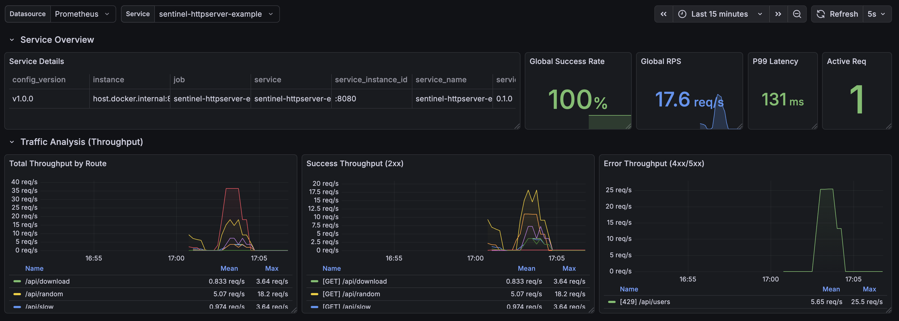
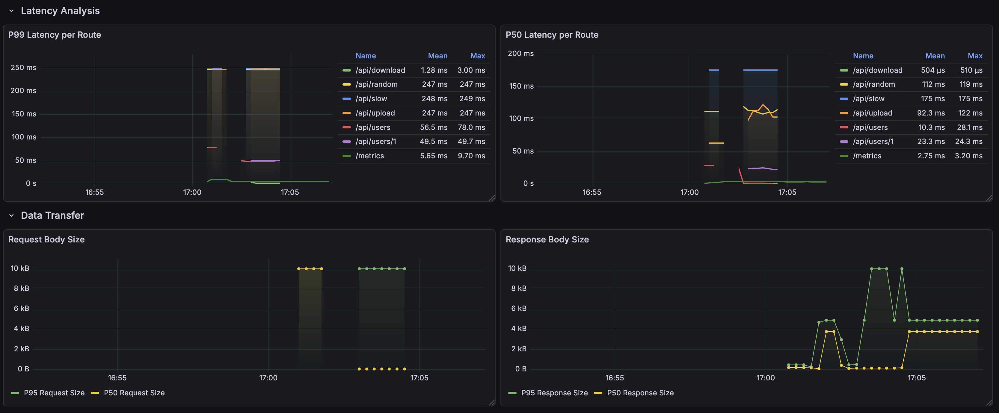

# HTTP Server Observability Example with Sentinel-Go

This directory contains a complete, self-contained example demonstrating how to build a production-ready HTTP server using `sentinel-go/httpserver` with **Tempo** (Distributed Tracing), **Prometheus** (Metrics), and **Grafana** (Visualization).

## 🚀 Quick Start

Get everything running in under 2 minutes.

### Prerequisites

- [Docker](https://docs.docker.com/get-docker/) & Docker Compose
- [Go](https://go.dev/dl/) 1.21 or newer

### 1. Start Infrastructure

We use Docker Compose to spin up:

- **Tempo**: Distributed tracing backend (port 4319 for OTLP)
- **Prometheus**: Time-series metrics database (port 9057)
- **Grafana**: Unified observability UI (port 3002)

```bash
cd example/httpserver
docker-compose -f deployments/docker-compose.yaml up -d
```

**Verify all services are running:**

```bash
docker-compose -f deployments/docker-compose.yaml ps
```

> **Note**: Wait 5-10 seconds for services to initialize. First startup takes longer (downloading images).

### 2. Run the Application

The server starts and listens for HTTP requests:

```bash
# Using make (recommended)
make run

# Or build and run manually
go run cmd/server/main.go
```

You should see output like:

```text
✅ HTTP Server Example started!
🌐 Server:     http://localhost:8080
📊 Metrics:    http://localhost:8080/metrics
🔍 Grafana:    http://localhost:3002

Available endpoints:
  GET  /home          - Home
  GET  /api/users     - List users
  GET  /api/users/{id} - Get user
  POST /api/users     - Create user
  PUT  /api/users/{id} - Update user
  DELETE /api/users/{id} - Delete user
  GET  /api/slow      - Slow endpoint
  GET  /api/error     - Error endpoint
  GET  /api/random    - Random data
  GET  /ping          - Ping
  GET  /livez         - Liveness probe
  GET  /readyz        - Readiness probe
  GET  /metrics       - Prometheus metrics

Press Ctrl+C to stop...
```

### 3. Generate Traffic

Make some requests to generate metrics and traces:

```bash
# Test the API
curl http://localhost:8080/api/users
curl http://localhost:8080/api/users/1
curl -X POST http://localhost:8080/api/users -d '{"name":"Test","email":"test@example.com"}'
curl http://localhost:8080/api/random
```

Or use the load test target:

```bash
# Install hey: go install github.com/rakyll/hey@latest
make load-test
```

---

## 🌐 Service Access

| Service         | URL                             | Purpose                                      |
| --------------- | ------------------------------- | -------------------------------------------- |
| **Server**      | <http://localhost:8080>         | Your HTTP API                                |
| **Grafana**     | <http://localhost:3002>         | View traces and metrics (main UI)            |
| **Prometheus**  | <http://localhost:9057>         | Raw metrics queries                          |
| **App Metrics** | <http://localhost:8080/metrics> | Application metrics endpoint                 |
| **Tempo**       | <http://localhost:3202>         | Tempo API (backend only, use Grafana for UI) |

### Pre-built Dashboards

Grafana comes with a pre-configured dashboard:

**"Sentinel-Go: HTTP Server Metrics"** - Comprehensive view of:

- Request latency percentiles (P50, P95, P99)
- Request rate by HTTP method and path
- Active requests gauge
- Error rate (5xx responses)
- Status code distribution
- Request/Response body sizes

**Access**: Grafana Home → Dashboards → "Sentinel-Go: HTTP Server Metrics"

### Grafana Dashboard





## ✨ Features Demonstrated

This example showcases all features of the `sentinel-go/httpserver` package:

### Server Configuration

```go
server := httpserver.New(
    // Base configuration
    httpserver.WithConfig(httpserver.ProductionConfig()),
    httpserver.WithServiceName("sentinel-httpserver-example"),
    httpserver.WithLogger(logger),
    httpserver.WithHandler(mux),

    // Health checks
    httpserver.WithHealth(&health, "0.1.0"),

    // Observability
    httpserver.WithTracing(httpserver.TracingConfig{
        SkipPaths: []string{"/ping", "/livez", "/readyz"},
    }),
    httpserver.WithMetrics(httpserver.MetricsConfig{
        SkipPaths: []string{"/ping", "/livez", "/readyz"},
    }),
    httpserver.WithLogging(httpserver.LoggerConfig{
        Logger:    logger,
        SkipPaths: []string{"/ping", "/livez", "/readyz"},
    }),

    // Rate limiting
    httpserver.WithRateLimit(httpserver.RateLimitConfig{
        Limit: 100,
        Burst: 200,
    }),
)
```

### Configuration Presets

```go
// Production-ready with hardened timeouts
httpserver.WithConfig(httpserver.ProductionConfig())

// Development with relaxed settings
httpserver.WithConfig(httpserver.DevelopmentConfig())

// Balanced defaults
httpserver.WithConfig(httpserver.DefaultConfig())
```

### Health Checks

```go
var health *httpserver.HealthHandler
server := httpserver.New(
    httpserver.WithHealth(&health, "1.0.0"),
    httpserver.WithHandler(mux),
)

// Add readiness checks
health.AddReadinessCheck("database", dbPingCheck)
health.AddReadinessCheck("redis", redisPingCheck)

// Register endpoints
mux.Handle("GET /ping", health.PingHandler())
mux.Handle("GET /livez", health.LiveHandler())
mux.Handle("GET /readyz", health.ReadyHandler())
```

### Middleware Stack

The server automatically applies middleware in the correct order:

1. **Recovery** - Panic recovery with stack traces
2. **RequestID** - Unique ID for each request
3. **Tracing** - OpenTelemetry distributed tracing
4. **Metrics** - Request duration, status codes, sizes
5. **Logging** - Structured request/response logging
6. **RateLimit** - Token bucket rate limiting

### Custom Middleware

```go
server := httpserver.New(
    httpserver.WithHandler(mux),
    httpserver.WithMiddleware(
        httpserver.Recovery(logger),
        httpserver.RequestID(),
        httpserver.CORS(corsConfig),
        myCustomMiddleware,
    ),
)
```

---

## 🔍 What to Observe

### 1. Distributed Tracing (Grafana + Tempo)

Open [http://localhost:3002](http://localhost:3002)

**Navigate to Explore:**

1. Click **Explore** (compass icon) in the left sidebar
2. Select **Tempo** as the data source
3. Click **Search** tab
4. Set **Service Name** = `sentinel-httpserver-example`
5. Click **Run Query**

**Span Attributes:**

- `http_request_method`: GET, POST, PUT, DELETE
- `http_route`: Request path
- `http_response_status_code`: Response status
- `service_name`: Service name

### 2. Metrics (Prometheus)

#### Raw Metrics Endpoint

Visit [http://localhost:2113/metrics](http://localhost:2113/metrics) to see raw metrics.

**Key Metrics:**

```promql
# Request duration percentiles
histogram_quantile(0.95, rate(http_server_request_duration_seconds_bucket[1m]))

# Request rate
sum(rate(http_server_request_total[1m]))

# Error rate (5xx)
sum(rate(http_server_request_total{http_response_status_code=~"5.."}[5m])) /
sum(rate(http_server_request_total[5m]))

# Active requests
http_server_active_requests
```

---

## 📊 Metrics Reference

| Metric Name                            | Type      | Description                   |
| -------------------------------------- | --------- | ----------------------------- |
| `http_server_request_duration_seconds` | Histogram | Request latency in seconds    |
| `http_server_request_size`             | Histogram | Request body size in bytes    |
| `http_server_response_size`            | Histogram | Response body size in bytes   |
| `http_server_active_requests`          | Gauge     | In-flight requests            |
| `http_server_request_total`            | Counter   | Total requests                |
| `http_server_response_status`          | Counter   | Response count by status code |

---

## 🧹 Cleanup

Stop and remove all containers:

```bash
docker-compose -f deployments/docker-compose.yaml down
```

---

## 🐛 Troubleshooting

### Error: "connection reset by peer" on port 4319

**Cause**: Tempo service isn't running or unreachable.

**Solution**:

```bash
docker-compose -f deployments/docker-compose.yaml restart tempo
```

### Error: No metrics in Prometheus

**Cause**: Prometheus can't scrape the app on the host machine.

**Solution**:

- Verify the app is running and accessible at `http://localhost:8080/metrics`
- On Linux, update `prometheus.yml` to use your host IP instead of `host.docker.internal`

---

## 💡 Tips

**Test rate limiting:**

```bash
# Send many requests quickly
for i in {1..300}; do curl -s -o /dev/null -w "%{http_code}\n" http://localhost:8080/api/users; done

# You'll see 429 responses once rate limit is exceeded
```

**Test error endpoint:**

```bash
# The error endpoint returns random error codes
for i in {1..10}; do curl -s -o /dev/null -w "%{http_code}\n" http://localhost:8080/api/error; done
```

**Test slow endpoint:**

```bash
# Default 2 second delay
curl http://localhost:8080/api/slow

# Custom delay
curl "http://localhost:8080/api/slow?delay=5s"
```
