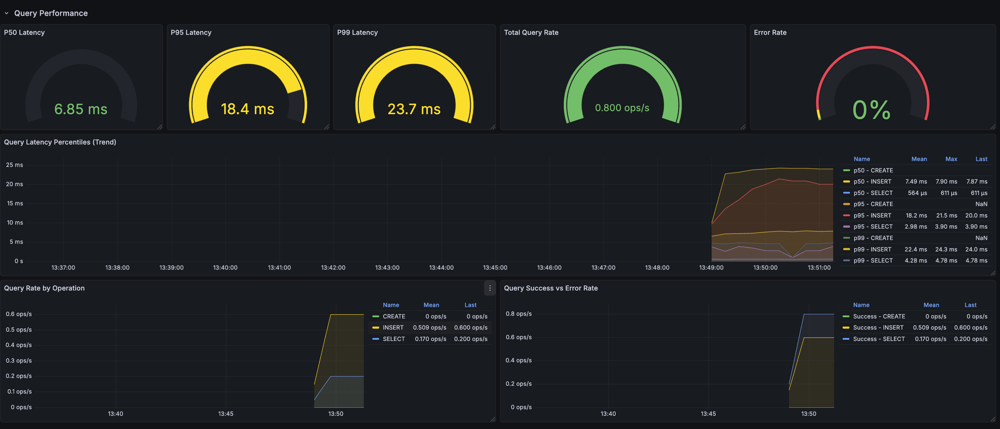

# SQL Observability Example with Sentinel-Go

This directory contains a complete, self-contained example demonstrating how to instrument a Go application using `sentinel-go` with **PostgreSQL**, **Tempo** (Distributed Tracing), **Prometheus** (Metrics), and **Grafana** (Visualization).

## 🚀 Quick Start

Get everything running in under 2 minutes.

### Prerequisites

- [Docker](https://docs.docker.com/get-docker/) & Docker Compose
- [Go](https://go.dev/dl/) 1.21 or newer

### 1. Start Infrastructure

We use Docker Compose to spin up:

- **PostgreSQL**: The database we will interact with (port 5588)
- **Tempo**: Distributed tracing backend (port 4317 for OTLP)
- **Prometheus**: Time-series metrics database (port 9055)
- **Grafana**: Unified observability UI (port 3000)

```bash
cd example/sql
docker-compose -f deployments/docker-compose.yaml up -d
```

**Verify all services are running:**

```bash
docker-compose -f deployments/docker-compose.yaml ps
```

All services should show "Up" status. If any service is missing or unhealthy:

```bash
docker-compose -f deployments/docker-compose.yaml logs <service-name>  # Check logs
docker-compose -f deployments/docker-compose.yaml restart <service-name>  # Restart specific service
```

> **Note**: Wait 5-10 seconds for services to initialize. First startup takes longer (downloading images).

### 2. Run the Application

The application runs continuously and performs database operations every 5 seconds:

```bash
# Using make (recommended)
make run

# Or build and run manually
go build -o example-server ./cmd/server
./example-server
```

You should see output like:

```text
✅ Example app started!
📊 Prometheus metrics: http://localhost:2112/metrics
🔍 Grafana UI: http://localhost:3000
Press Ctrl+C to stop...
✓ Database operations completed
📖 Queried 3 users
```

**Leave it running** to generate metrics and traces!

---

## 🌐 Service Access

| Service         | URL                           | Purpose                                      |
| --------------- | ----------------------------- | -------------------------------------------- |
| **Grafana**     | http://localhost:3000         | View traces and metrics (main UI)            |
| **Prometheus**  | http://localhost:9055         | Raw metrics queries                          |
| **App Metrics** | http://localhost:2112/metrics | Application metrics endpoint                 |
| **Tempo**       | http://localhost:3200         | Tempo API (backend only, use Grafana for UI) |

### Pre-built Dashboards

Grafana comes with a pre-configured dashboard:

**"Sentinel-Go: Database Metrics"** - Comprehensive view of:

- Query duration percentiles (p50, p95, p99)
- Query rate by operation (SELECT, INSERT, etc.)
- Error rate and total throughput
- Connection pool status (open, idle, in-use, max)
- Connection wait statistics

**Access**: Grafana Home → Dashboards → "Sentinel-Go: Database Metrics"

---

## 🔍 What to Observe

### 1. Distributed Tracing (Grafana + Tempo)

Open [http://localhost:3000](http://localhost:3000)

**Navigate to Explore:**

1. Click **Explore** (compass icon) in the left sidebar
2. Select **Tempo** as the data source
3. Click **Search** tab
4. Set **Service Name** = `sentinel-sql-example`
5. Click **Run Query**

**Inspect Traces:**

- Click on any trace to see the timeline
- Parent span: `db-operations`
- Child spans: `INSERT`, `SELECT` operations

**Span Attributes:**

- `db.system`: `postgresql`
- `db.statement`: Sanitized query (e.g., `INSERT INTO users ... VALUES (?, ?)`)
- `db.operation`: `INSERT`, `SELECT`, etc.
- `db.name`: `example_db`
- `db.instance`: `primary`

### 2. Metrics (Prometheus)

#### Raw Metrics Endpoint

Visit [http://localhost:2112/metrics](http://localhost:2112/metrics) to see raw metrics.

#### Prometheus UI

Open [http://localhost:9055](http://localhost:9055)

**Key Metrics to Query:**

**Query Duration Histogram:**

```promql
# Average query duration
rate(db_client_operation_duration_sum[1m]) / rate(db_client_operation_duration_count[1m])

# 95th percentile query latency
histogram_quantile(0.95, rate(db_client_operation_duration_bucket[1m]))
```

**Connection Pool Metrics:**

```promql
# Open connections
db_client_connections_open

# Idle vs In-Use
db_client_connections_idle
db_client_connections_used

# Wait statistics
rate(db_client_connections_wait_count[1m])
rate(db_client_connections_wait_duration[1m])
```

**Create a Dashboard:**

1. Go to **Graph** tab
2. Enter the PromQL query
3. Click **Execute**
4. Visualize query latencies and connection pool stats!

### Grafana Dashboard

**Query Duration:**



**Connection Pool:**


---

## 🛠️ Implementation Details

### How it Works

**1. Dual Exporter Setup**

```go
// Tracing → Tempo (OTLP)
traceExporter := otlptracegrpc.New(...)
otel.SetTracerProvider(...)

// Metrics → Prometheus (Pull-based)
promExporter := prometheus.New()
otel.SetMeterProvider(...)
http.Handle("/metrics", promhttp.Handler())
```

**2. Database Instrumentation**

```go
db, _ := sentinelsql.Open("postgres", dsn,
    sentinelsql.WithDBSystem("postgresql"),
    sentinelsql.WithDBName("example_db"),
)

// Pool metrics auto-detect attributes!
sentinelsql.RecordPoolMetrics(db, meter)
```

**3. Continuous Operations**
The app runs in a loop (every 5 seconds) to generate:

- INSERT operations → metrics + traces
- SELECT operations → metrics + traces

This gives you live, continuously updating observability data.

**4. Graceful Shutdown**
Press `Ctrl+C` to cleanly shutdown:

- Flushes pending traces
- Shuts down metrics server
- Closes database connections

---

## 📊 Metrics Reference

| Metric Name                           | Type      | Description                 | Labels                                           |
| ------------------------------------- | --------- | --------------------------- | ------------------------------------------------ |
| `db_client_operation_duration`        | Histogram | Query latency in seconds    | `db.system`, `db.name`, `db.operation`, `status` |
| `db_client_connections_open`          | Gauge     | Total open connections      | `db.system`, `db.name`                           |
| `db_client_connections_idle`          | Gauge     | Idle connections            | `db.system`, `db.name`                           |
| `db_client_connections_used`          | Gauge     | Connections in use          | `db.system`, `db.name`                           |
| `db_client_connections_max`           | Gauge     | Max connection limit        | `db.system`, `db.name`                           |
| `db_client_connections_wait_count`    | Counter   | Times waited for connection | `db.system`, `db.name`                           |
| `db_client_connections_wait_duration` | Counter   | Total wait time (seconds)   | `db.system`, `db.name`                           |

---

## 🧹 Cleanup

Stop and remove all containers:

```bash
docker-compose down
```

---

## � Troubleshooting

### Error: "connection reset by peer" on port 4317

```
trace export: rpc error: code = Unavailable desc = connection error
```

**Cause**: Tempo service isn't running or unreachable.

**Solution**:

```bash
# Check if Docker services are running
docker-compose ps

# If tempo is not running, restart
docker-compose restart tempo

# Or restart all services
docker-compose down && docker-compose up -d
```

### Error: No metrics in Prometheus

**Cause**: Prometheus can't scrape the app on the host machine.

**Solution**:

- Verify the app is running and accessible at `http://localhost:2112/metrics`
- On macOS/Windows with Docker Desktop, `host.docker.internal` works automatically
- On Linux, update `prometheus.yml` to use `host.docker.internal` or your host IP

### Services won't start

```bash
# Check logs for specific service
docker-compose logs grafana
docker-compose logs tempo
docker-compose logs prometheus

# Clean restart
docker-compose down -v  # -v removes volumes
docker-compose up -d
```

---

## �💡 Tips

**Simulate Load:**

```bash
# Run multiple instances to see pool metrics change
go run main.go &
go run main.go &
go run main.go &
```

**Query Errors:**
Modify the SQL queries to introduce errors and see them tracked in:

- Prometheus: `status="error"` label
- Grafana/Tempo: Span status and error events
