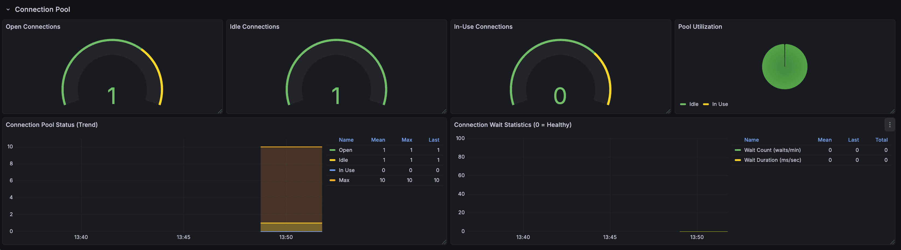

# SQLX Observability Example with Sentinel-Go

This directory contains a complete, self-contained example demonstrating how to instrument a Go application using `sentinel-go/sqlx` with **PostgreSQL**, **Tempo** (Distributed Tracing), **Prometheus** (Metrics), and **Grafana** (Visualization).

## 🚀 Quick Start

Get everything running in under 2 minutes.

### Prerequisites

- [Docker](https://docs.docker.com/get-docker/) & Docker Compose
- [Go](https://go.dev/dl/) 1.21 or newer

### 1. Start Infrastructure

We use Docker Compose to spin up:

- **PostgreSQL**: The database we will interact with (port 5588)
- **Tempo**: Distributed tracing backend (port 4317 for OTLP)
- **Prometheus**: Time-series metrics database (port 9055)
- **Grafana**: Unified observability UI (port 3000)

```bash
cd example/sqlx
docker-compose -f deployments/docker-compose.yaml up -d
```

**Verify all services are running:**

```bash
docker-compose -f deployments/docker-compose.yaml ps
```

All services should show "Up" status.

> **Note**: Wait 5-10 seconds for services to initialize.

### 2. Run the Application

The application runs continuously and performs database operations every 5 seconds:

```bash
# Using make (recommended)
make run

# Or build and run manually
go build -o example-server ./cmd/server
./example-server
```

You should see output like:

```text
✅ SQLX Example app started!
📊 Prometheus metrics: http://localhost:2112/metrics
🔍 Grafana UI: http://localhost:3000
Press Ctrl+C to stop...
✓ Database operations completed
📖 Queried 3 users via SelectContext
📖 Got user via GetContext: Alice (alice@example.com)
📖 Transaction query result: Transaction User (tx@example.com)
✅ Transaction committed successfully
```

**Leave it running** to generate metrics and traces!

---

## 🌐 Service Access

| Service         | URL                           | Purpose                                      |
| --------------- | ----------------------------- | -------------------------------------------- |
| **Grafana**     | http://localhost:3000         | View traces and metrics (main UI)            |
| **Prometheus**  | http://localhost:9055         | Raw metrics queries                          |
| **App Metrics** | http://localhost:2112/metrics | Application metrics endpoint                 |
| **Tempo**       | http://localhost:3200         | Tempo API (backend only, use Grafana for UI) |

---

## 🔍 What to Observe

### 1. Distributed Tracing (Grafana + Tempo)

Open [http://localhost:3000](http://localhost:3000)

**Navigate to Explore:**

1. Click **Explore** (compass icon) in the left sidebar
2. Select **Tempo** as the data source
3. Click **Search** tab
4. Set **Service Name** = `sentinel-sqlx-example`
5. Click **Run Query**

**Inspect Traces:**

- Click on any trace to see the timeline
- Parent span: `db-operations`
- Child spans: `sqlx.Get`, `sqlx.Select`, `INSERT`, `SELECT` operations

**Span Attributes:**

- `db.system`: `postgresql`
- `db.statement`: Sanitized query (e.g., `SELECT * FROM users WHERE name = ?`)
- `db.operation`: `SELECT`, `INSERT`, etc.
- `db.name`: `example_db`
- `db.instance`: `primary`

### 2. Metrics (Prometheus)

#### Raw Metrics Endpoint

Visit [http://localhost:2112/metrics](http://localhost:2112/metrics) to see raw metrics.

#### Prometheus UI

Open [http://localhost:9055](http://localhost:9055)

**Key Metrics to Query:**

```promql
# Average query duration
rate(db_client_operation_duration_sum[1m]) / rate(db_client_operation_duration_count[1m])

# 95th percentile query latency
histogram_quantile(0.95, rate(db_client_operation_duration_bucket[1m]))

# Connection Pool
db_client_connections_open
db_client_connections_idle
db_client_connections_used
```

### Grafana Dashboard

**Query Duration:**


**Connection Pool:**



---

## 🛠️ Implementation Details

### Key SQLX Features Demonstrated

**1. SelectContext (Multiple Rows → Slice)**

```go
var users []User
err := db.SelectContext(ctx, &users, "SELECT id, name, email FROM users LIMIT 10")
```

**2. GetContext (Single Row → Struct)**

```go
var user User
err := db.GetContext(ctx, &user, "SELECT * FROM users WHERE name = $1", "Alice")
```

**3. Transactions with BeginTxx**

```go
tx, err := db.BeginTxx(ctx, nil)
tx.ExecContext(ctx, "INSERT INTO users ...")
tx.GetContext(ctx, &user, "SELECT * FROM users WHERE ...")
tx.Commit()
```

**4. Database Instrumentation**

```go
db, _ := sentinelsqlx.Open("postgres", dsn,
    sentinelsqlx.WithDBSystem("postgresql"),
    sentinelsqlx.WithDBName("example_db"),
)

// Pool metrics auto-detect attributes!
sentinelsqlx.RecordPoolMetrics(db.DB, meter)
```

---

## 📊 Metrics Reference

| Metric Name                           | Type      | Description                 | Labels                                           |
| ------------------------------------- | --------- | --------------------------- | ------------------------------------------------ |
| `db_client_operation_duration`        | Histogram | Query latency in seconds    | `db.system`, `db.name`, `db.operation`, `status` |
| `db_client_connections_open`          | Gauge     | Total open connections      | `db.system`, `db.name`                           |
| `db_client_connections_idle`          | Gauge     | Idle connections            | `db.system`, `db.name`                           |
| `db_client_connections_used`          | Gauge     | Connections in use          | `db.system`, `db.name`                           |
| `db_client_connections_max`           | Gauge     | Max connection limit        | `db.system`, `db.name`                           |
| `db_client_connections_wait_count`    | Counter   | Times waited for connection | `db.system`, `db.name`                           |
| `db_client_connections_wait_duration` | Counter   | Total wait time (seconds)   | `db.system`, `db.name`                           |

---

## 🧹 Cleanup

Stop and remove all containers:

```bash
docker-compose down
```

---

## 🐛 Troubleshooting

### Error: "connection reset by peer" on port 4317

**Cause**: Tempo service isn't running or unreachable.

**Solution**:

```bash
docker-compose ps                  # Check status
docker-compose restart tempo       # Restart Tempo
```

### Services won't start

```bash
docker-compose logs grafana        # Check logs
docker-compose down -v             # Clean restart with volumes removed
docker-compose up -d
```
